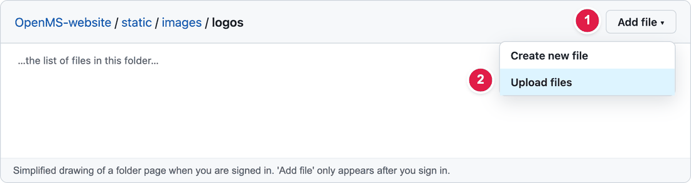
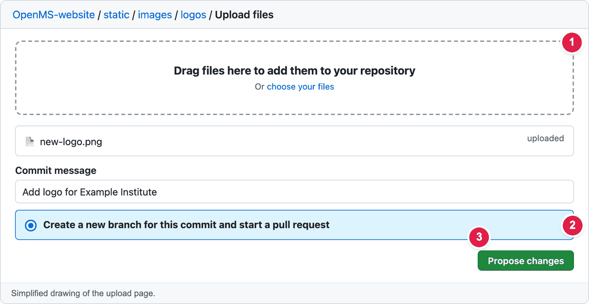

# Add a picture or logo to the website

Whenever a guide says "upload the logo" or "add an image", this is the page you need. Pictures live in the folder **`static/images/`** of the website files on GitHub.

**Time:** about 10 minutes  ·  **Skills needed:** none

## The one thing to remember

A file in the folder `static/images/logos/` is shown on the website at the address starting with **`/images/logos/`**. In other words: **drop `static` from the path.**

| Where you upload it on GitHub | The path you write in config or in an article |
|-------------------------------|-----------------------------------------------|
| `static/images/logos/example.png` | `/images/logos/example.png` |
| `static/images/webapp/logo/mytool.png` | `/images/webapp/logo/mytool.png` |

## Which folder?

| What the picture is | Upload it to |
|---------------------|--------------|
| A sponsor or a partner logo | `static/images/logos/` |
| The logo of a **Featured App** | `static/images/webapp/logo/` |
| The logo of an **Affiliated App** | `static/images/webapp/logo/affiliate/` |
| A picture for the **Developer Retreat** page | `static/images/` |
| A picture for a **news article** | `static/images/news_images/` |
| A photo for the **community** block on the home page | `static/images/community/` |

## Step by step

### Step 1 – Get the picture ready

- Use **PNG** or **SVG** for logos, **JPG** for photos.
- Use a **small, simple file name**: only small letters, numbers, `-` and `_`, no spaces. For example `my-tool-logo.png`, not `My Tool Logo (1).PNG`. Capital letters matter on the website, so keep them small.
- Keep the file **under about 500 KB**. For photos, 1600 pixels wide is plenty.

### Step 2 – Open the right folder on GitHub

Open the folder on GitHub. For example, for sponsor logos:

**https://github.com/OpenMS/OpenMS-website/tree/main/static/images/logos**

Click **Add file** (top right), then **Upload files**.



| Number | What to do |
|:--:|------------|
| 1 | Click **Add file**. (You only see it when you are signed in to GitHub. If GitHub asks you to **fork** the repository, accept.) |
| 2 | Click **Upload files**. |

### Step 3 – Drop the picture in and save



| Number | What to do |
|:--:|------------|
| 1 | **Drag the file** from your computer into the dashed box (or click **choose your files**). Wait until it says *uploaded*. |
| 2 | Choose **Create a new branch for this commit and start a pull request**. Add a short note above, like *Add logo for Example Institute*. |
| 3 | Click **Propose changes**, then **Create pull request** (as in [How to make a change](../getting-started/edit-via-github.md#step-4--send-it-for-review-create-pull-request)). |

### Step 4 – Use the picture

Now write its path where the guide tells you to, for example in `config.yaml`:

```yaml
logo: /images/webapp/logo/mytool.png
```

or inside a news article (Markdown):

```markdown

```

The words between the square brackets are the **description** for people who can't see the picture. Please always write something short there.

## Replace a picture that is already there

You want a **new photo or logo in the same place**, without touching any text? The easiest way is to upload the new picture **with exactly the same file name** as the old one. GitHub then replaces the old picture.

1. Find the **current file name**. It is the last part of the path in the guide's config lines, for example `/images/dev_retreat_2026.jpeg` means the file `dev_retreat_2026.jpeg` in the folder `static/images/`.
2. Rename your new picture on your computer to that **exact name**, including capital letters and the ending (`.jpeg` is not the same as `.jpg`).
3. Open the folder on GitHub, click **Add file → Upload files** and upload it, as in the steps above.
4. GitHub shows the file as **modified**. Continue with **Propose changes** as usual.

> **Different ending** (the old one was `.jpeg`, your new one is `.png`)? Then the name is not the same. Upload the new picture under a **new name** and change the path in `config.yaml` to match (see Step 4 above).

After the preview is ready, if you still see the old picture, refresh without the cache (**Ctrl + Shift + R**, or **Cmd + Shift + R** on Mac).

## Make the preview show the picture

The text change and the picture should be in the **same pull request**, otherwise the preview of the text change shows a broken picture. Two simple ways:

- **Easiest:** upload the picture first, wait until the web team merges it, then make the text change.
- **Faster:** after you made your text change, open the folder on GitHub, use the **branch menu** at the top left of the file list to select **your branch** (the one your pull request is on), and then upload the picture as above. Choose **Commit directly to the … branch** this time.

## Check that it worked

After the preview is ready, open the picture's address directly. Take the **Deploy Preview** address and add the path, for example:

```
https://deploy-preview-123--openms.netlify.app/images/logos/example.png
```

If you see the picture, the path is right.

## Common mistakes

| What went wrong | How to fix it |
|-----------------|---------------|
| The picture is broken (a small empty frame) | The path doesn't match the file name **exactly**. Capital letters, dashes and the ending (`.png` vs `.jpg`) all matter. And the path starts with `/images/`, **not** `static/images/`. |
| The picture is tiny or huge | Use a different file, or ask the web team to adjust the size. |
| Upload says the file is too large | Make the picture smaller (for example in the free tool *Squoosh*: squoosh.app) and try again. |
| A picture with a transparent background has a white box | Use a PNG or SVG with a transparent background. |

## For the web team

Some theme images are referenced by **file name only** (for example in `heroGroup`). They are resolved by the theme: copy the pattern of the neighbouring entries in `config.yaml`. In Markdown pages the `figure` shortcode also works: ``.

## Related guides

- [Featured Apps](update-featured-apps.md)
- [Sponsors](update-sponsors.md)
- [Developer Retreat photos](update-developer-retreat.md)
- [Logos on the home page](update-adopted-by-logos.md)
- [Add a news article](add-news-post.md)
- Back to the [list of all guides](../README.md)
