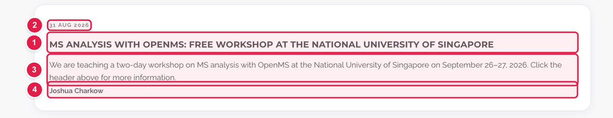
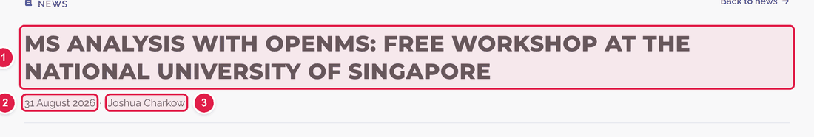
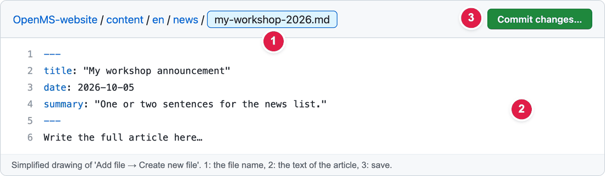
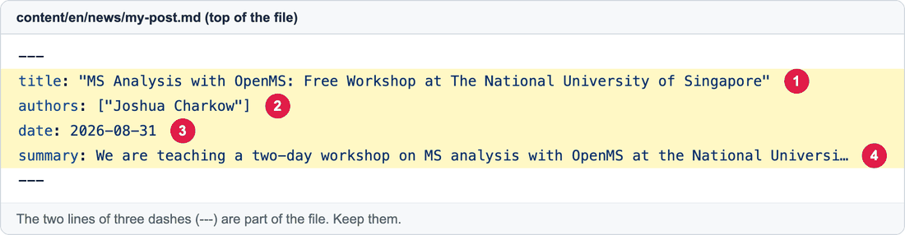

# Add a news article

News articles (releases, workshops, announcements) appear on **https://openms.de/news/**. Each article is **one small text file**. You create it on GitHub, in your browser.

**You will create:** one new file  ·  **Time:** about 15 minutes  ·  **Skills needed:** none

## What you will change

Every article shows up in **two places**. The same four pieces of information come from the top of your file:

**1. In the news list** (`/news/`)



**2. On the article page** (when someone clicks the title)



| Number | What it is | Where you type it |
|:--:|------------|-------------------|
| 1 | **Title** (headline) | the `title:` line |
| 2 | **Date** | the `date:` line |
| 3 | **Short summary** (only on the list card) | the `summary:` line |
| 4 | **Author names** | the `authors:` line |

Everything **under** that top block is the article text, which only appears on the article page.

## Step by step

### Step 1 – Choose a file name

The file name becomes the web address of your article. Use:

- only **small letters, numbers and hyphens** (no spaces, no capital letters),
- and finish with `.md`.

| File name | Web address |
|-----------|-------------|
| `my-workshop-2026.md` | `https://openms.de/news/my-workshop-2026/` |

### Step 2 – Create a new file on GitHub

1. Open the news folder: **https://github.com/OpenMS/OpenMS-website/tree/main/content/en/news**
2. Click the **Add file** button (top right), then **Create new file**.

   > Don't see **Add file**? Log in to GitHub first. If GitHub offers to **fork** the repository, accept. It is safe (see [How to make a change](../getting-started/edit-via-github.md#step-1--open-the-file)).

3. In the box **"Name your file…"**, type your file name from Step 1.



| Number | What to do |
|:--:|------------|
| 1 | Type the **file name**. |
| 2 | Paste or type the **article** (Step 3). |
| 3 | Save when you finish (Step 4). |

### Step 3 – Copy this template into the big text box

The top part (between the two lines of `---`) holds the details. Below it you write the article.



Copy this, then **replace the text in the quotes**:

```yaml
---
title: "My workshop announcement"
authors: ["Your Name"]
date: 2026-10-05
summary: "One or two sentences that will appear on the news list."
---

Write your article here. Leave an empty line between paragraphs.
```

| Number | Line | What to type |
|:--:|------|--------------|
| 1 | `title:` | The headline. |
| 2 | `authors:` | Your name, **inside quotes and square brackets**. For several people: `["Anna Smith", "Ben Jones"]`. |
| 3 | `date:` | Year-month-day, like `2026-10-05`. **No quotes.** |
| 4 | `summary:` | A short teaser (1–2 sentences). |

Rules that avoid problems:

- Keep both lines of three dashes `---`. They mark the top block.
- Keep the **quotes** around title and summary, especially if they contain a colon (`:`).
- Write `key: value` with **one space** after the colon. Do not indent these lines.
- **Do not use a date in the future.** The website hides articles dated after today, so your article would not appear until that day.
- Want to save it without showing it yet? Add a line `draft: true` in the top block. Remove it when you are ready.

### Step 4 – Write the article

Under the second `---`, write normally. A few helpful symbols:

| You want | You type |
|----------|----------|
| A new paragraph | an empty line between two paragraphs |
| **Bold** text | `**bold text**` |
| A link | `[text people see](https://example.org)` |
| A section title | `## Section title` |
| A bullet list | start each line with `- ` |
| An image | `` – see [Add images](add-images.md) |

### Step 5 – Save and send for review

Follow steps 3 to 6 in **[How to make a change](../getting-started/edit-via-github.md#step-3--save-commit-changes)**:
**Commit changes… → Create a new branch… → Propose changes → Create pull request.**

For the note, write something like *Add news article: My workshop*.

### Step 6 – Check the preview

Open the **Deploy Preview** link on your pull request (see [Step 5 there](../getting-started/edit-via-github.md#step-5--check-the-preview)), then add `/news/` to the address. Check:

- [ ] The card is in the news list, with the right title, date and summary.
- [ ] The article page opens and reads well.
- [ ] Links and images work.

Something wrong? Open the **Files changed** tab of your pull request, edit the file, and save again.

## Optional: show your article in the banner at the top of the site

See [Change the announcement bar](update-news-banner.md). Use `link: /news/my-workshop-2026/`.

## Common mistakes

| What went wrong | How to fix it |
|-----------------|---------------|
| My article is not in the list | The `date:` is in the future, or `draft: true` is still there. |
| The preview says **Failed** | Usually a missing `---`, a missing quote, or a title with a `:` that has no quotes. Compare with the template above. |
| The title shows strange symbols | Put the title inside **double quotes**. |
| Two articles overwrite each other | Choose a different file name. Each name must be unique. |
| An image doesn't show | The path must start with `/images/` and match the real file name exactly (small and capital letters count). |

## Related guides

- [Add images](add-images.md)
- [Change the announcement bar](update-news-banner.md)
- Back to the [list of all guides](../README.md)
