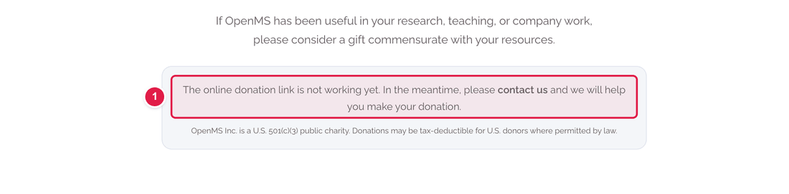
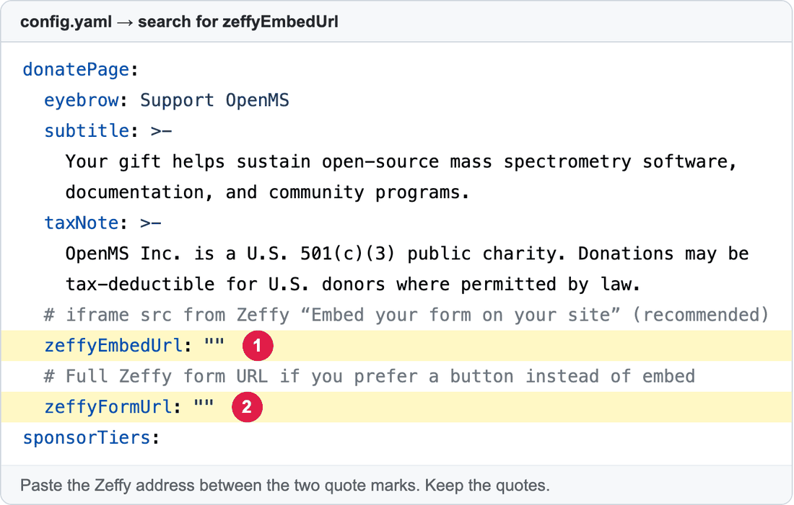

# Connect the Donate page to Zeffy

The **Donate** page (**https://openms.de/donate/**) collects gifts through **Zeffy**, a free donation service. For the donation form to appear, the website needs **one web address** from Zeffy.

**You will change:** one line in `config.yaml`  ·  **Time:** about 10 minutes  ·  **Skills needed:** none  ·  **You need:** access to the OpenMS Zeffy account (ask the treasurer or the web team)

## What it looks like now (before the address is added)



1. This message is shown **until** a Zeffy address is added. After you add it, it is replaced by the donation form.

## Step by step

### Step 1 – Get the address from Zeffy

1. Sign in to **https://www.zeffy.com/** with the OpenMS account.
2. Go to **Donations → My forms** and find the donation form for OpenMS Inc.
3. Click **Share**, then **Embed your form on your site** and choose the language.
4. You see a block of code that starts with `<iframe`. Inside it find `src="https://www.zeffy.com/embed/…"`. **Copy only the address between the quotes** (starting with `https://www.zeffy.com/`).

> Zeffy sometimes renames its menus. If you can't find these buttons, ask the web team or look for "Share" or "Embed" on the form's page.
> The address is public, so it is safe to put on the website. **Never paste a password or any bank detail** into any file.

### Step 2 – Put the address into `config.yaml`

1. Open **https://github.com/OpenMS/OpenMS-website/blob/main/config.yaml** and click the **pencil icon**. ([Need help?](../getting-started/edit-via-github.md#step-1--open-the-file))
2. Click inside the text box, press **Ctrl + F** (Windows) or **Cmd + F** (Mac) and search for `zeffyEmbedUrl`.
3. Paste the address **between the two quote marks**:



| Number | Line | What to do |
|:--:|------|-----------|
| 1 | `zeffyEmbedUrl:` | Paste the **embed address** from Zeffy. The form then appears on the Donate page itself. **Use this one.** |
| 2 | `zeffyFormUrl:` | **Optional.** Only if you prefer a button that opens Zeffy in a new tab. It is used only when `zeffyEmbedUrl` is empty. |

**Before**

```yaml
zeffyEmbedUrl: ""
```

**After**

```yaml
zeffyEmbedUrl: "https://www.zeffy.com/embed/donation-form/your-form-name"
```

Only addresses that start with `https://www.zeffy.com/` are accepted. Anything else is ignored.

### Step 3 – Save and send for review

[How to make a change, steps 3 to 6](../getting-started/edit-via-github.md#step-3--save-commit-changes).

### Step 4 – Check the preview

Open the **Deploy Preview**, add **/donate/** to the address and scroll to **Make a donation**.

- [ ] The Zeffy form is shown (not the grey message).
- [ ] The **Make a donation** button at the top of the page jumps to it.

Please **do not make a real test donation**. Just check that the form loads.

## Common mistakes

| What went wrong | How to fix it |
|-----------------|---------------|
| The grey "not working yet" message is still there | The address is empty, has a typo, or does not start with `https://www.zeffy.com/`. |
| The preview says **Failed** | The quotes are missing. Keep a `"` on each side of the address. |
| The form is cut off | Tell the web team. The height is set in the layout, not in `config.yaml`. |

## Related guides

- [Edit the footer links](edit-footer-or-navbar.md) (the footer *Donate* link goes to this page)
- Back to the [list of all guides](../README.md)
