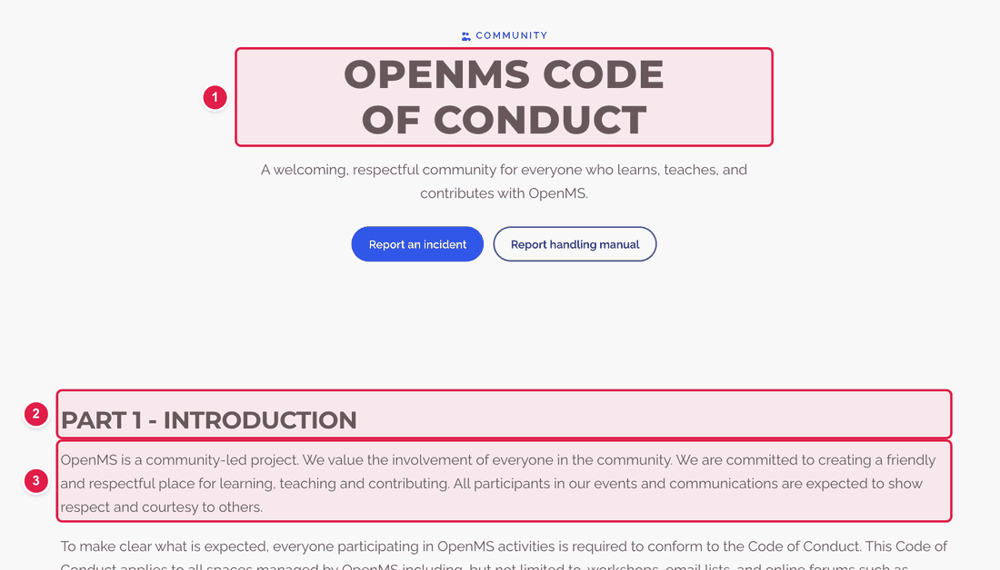
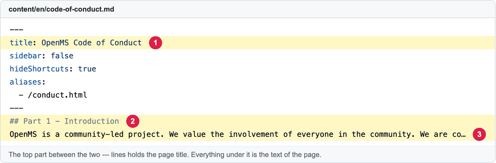

# Change the text of an existing page

Almost every page on the website has its words **somewhere in the website files**. This guide helps you **find where**, and then change them.

**You will change:** a few words in one file  ·  **Time:** about 10 minutes  ·  **Skills needed:** none

## Step 1 – Find where the words live

Words on a page can be in **one of three places**:

| Where | What it means | Can I edit it? |
|-------|---------------|----------------|
| **A. A page file** in `content/en/` | The text is in an easy `.md` text file named like the page. | **Yes.** This guide. |
| **B. `config.yaml`** | The text is in the big settings file. | **Yes.** Follow the guide for that page (table below). |
| **C. A layout file** in `layouts/` | The words are part of the page's design. | **Ask the web team.** |

### The quickest way to find it: search for a sentence

1. Copy **one distinctive sentence** from the live page (about 5 words in a row is enough).
2. Go to **https://github.com/OpenMS/OpenMS-website** and, signed in to GitHub, click the **search box** at the top (or press **/**). Paste your sentence in quotes, press **Enter** and choose **Code** on the left.
3. The result shows **which file** contains it. If it is a `.md` file or `config.yaml`, you can edit it. If it is in `layouts/`, ask the web team.

### Or use this table

| Page | Words are in | How to change |
|------|--------------|---------------|
| Code of Conduct | `content/en/code-of-conduct.md` | This guide |
| Executive Committee Charter (`/exec_committee/`) | `content/en/exec_committee.md` | This guide |
| Report Handling Manual | `content/en/report-handling-manual.md` | This guide |
| Impressum | `content/en/impressum.md` | This guide |
| Core Developers | `content/en/core_developers.md` | This guide |
| Privacy Policy | `content/en/privacy.md` | This guide, but keep the `###` and `####` heading lines exactly: the page is built from them. |
| Help | `content/en/help.md` | This guide. It contains some formatting symbols (`
`, `<strong>`): change only the words between them. |
| News articles | `content/en/news/…` | [Add a news article](add-news-post.md) |
| Home page | `config.yaml` | [Edit the home page](edit-homepage-hero.md) |
| Community calendar | `data/community_events.yaml` | [Calendar](update-community-calendar.md) |
| Featured / Affiliated Apps | `config.yaml` | [Featured](update-featured-apps.md) · [Affiliated](update-affiliated-apps.md) |
| Our Sponsors | `config.yaml` | [Sponsors](update-sponsors.md) |
| Developer Retreat | `config.yaml` | [Retreat](update-developer-retreat.md) |
| Publications | `pmids.txt` | [Publications](update-publications.md) |
| Donate | `config.yaml` | [Donate](configure-donate-zeffy.md) |
| Top menu and footer links | `config.yaml` | [Menu and footer](edit-footer-or-navbar.md) |
| Contribute, Fellowship, Governance, Contact, Research Partnerships, Sponsor Us, Services, OpenMS-lib, pyOpenMS, pyOpenMS-viz, Web apps | the **intro sentence** is in `config.yaml` (look for the page name followed by `Page`, for example `contactPage`); most **other words** are part of the design (layout) | Intro sentence: edit `config.yaml` like in the guides above. Other words: ask the web team. |
| Press kit | the layout | Ask the web team. |

## Step 2 – Edit a page file (type A)

Here is the Code of Conduct page next to the file it comes from.

**On the website**

**In the file** (`content/en/code-of-conduct.md`)

| Number | In the file | On the page |
|:--:|-------------|-------------|
| 1 | `title:` between the two `---` lines | The big title. |
| 2 | A line starting with `## ` | A section heading. |
| 3 | A normal line | A paragraph of text. |

### How to do it

1. Open the file on GitHub, for example **https://github.com/OpenMS/OpenMS-website/blob/main/content/en/code-of-conduct.md**, and click the **pencil icon**. ([Need help?](../getting-started/edit-via-github.md#step-1--open-the-file))
2. Find your sentence (**Ctrl + F** on Windows or **Cmd + F** on Mac, after clicking inside the text box).
3. Change the words, like in a Word document.
4. Save and send for review: [How to make a change, steps 3 to 6](../getting-started/edit-via-github.md#step-3--save-commit-changes).
5. In the **Deploy Preview**, open the page and check your change.

## Writing symbols you can use

Page files are written in **Markdown**, which is plain text with a few symbols.

| You want | You type |
|----------|----------|
| A new paragraph | Leave an **empty line** between the two paragraphs. |
| A section heading | `## Heading` (a space after the hashes). Use `###` for a smaller one. |
| **Bold** | `**bold words**` |
| *Italic* | `*italic words*` |
| A bullet list | Start each line with `- ` |
| A link to another page of this website | `[words people see](/governance/)` |
| A link to another website | `[words people see](https://openms.readthedocs.io/)` |
| An e-mail link | `[write to us](mailto:webmaster@openms.de)` |

## Do not touch

- The top block between the two lines of `---` (except the `title:` if you want a new title). Its other lines control how the page behaves.
- Lines that start with `{{<`. They are special building blocks. Ask the web team.

## Common mistakes

| What went wrong | How to fix it |
|-----------------|---------------|
| My text appears as one block | You need an **empty line** between paragraphs. |
| My link shows as `[words](address)` | A bracket or a parenthesis is missing. Both pairs are needed. |
| The page is wrong after my change | Open your pull request, click **Files changed**, edit again, and save. Or click **Close pull request** to cancel (see [I made a mistake](../getting-started/edit-via-github.md#i-made-a-mistake--what-now)). |
| I found the words only in `layouts/` | Ask the web team. See [Who to ask](../workflow/who-to-ask.md). |

## Related guides

- [How to make a change](../getting-started/edit-via-github.md)
- Back to the [list of all guides](../README.md)
