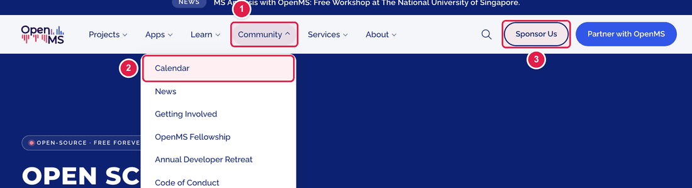
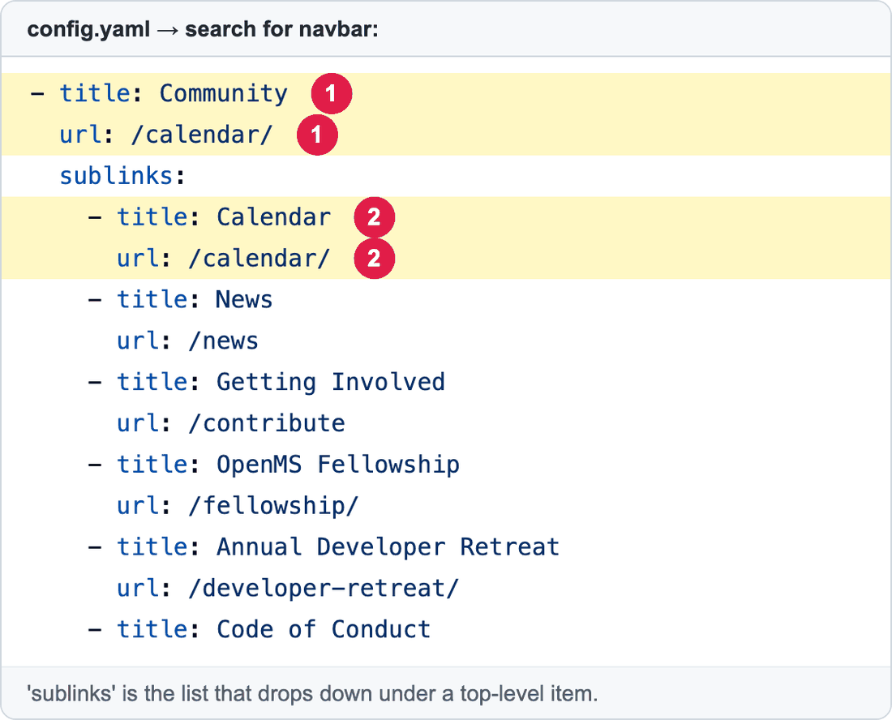
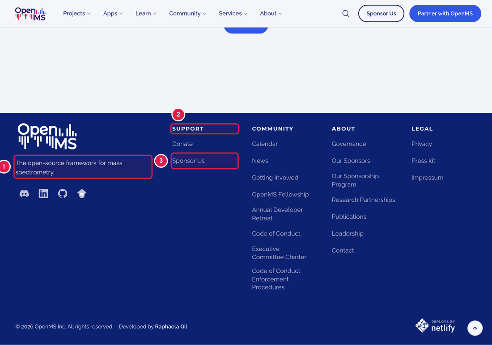
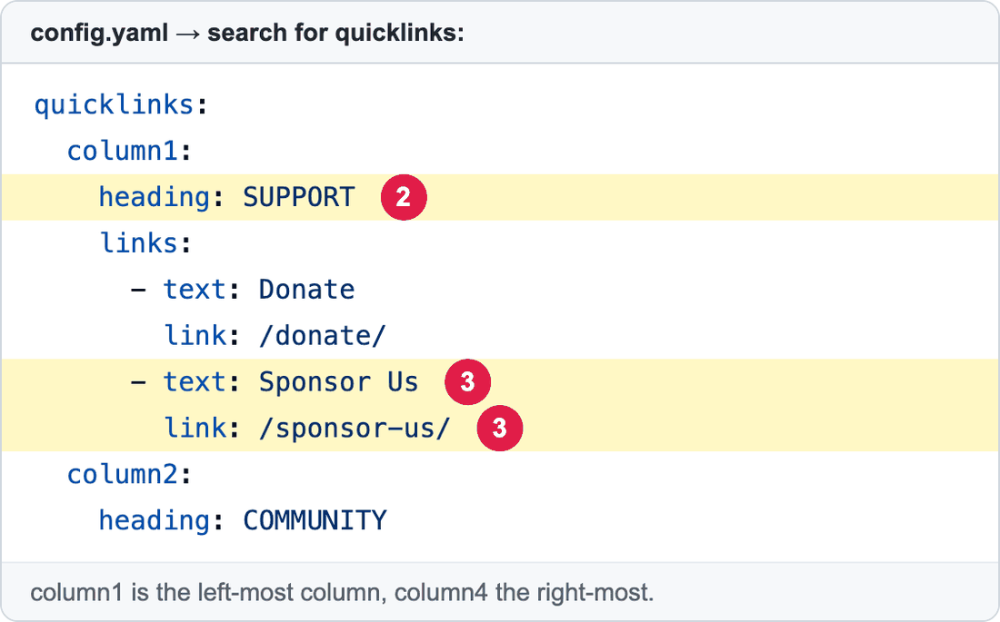

# Change the top menu or the footer links

Two things appear on **every page** of the website:

- the **menu at the top** (Projects, Apps, Learn, Community…), called the **navbar**;
- the **block at the bottom** with links in four columns, called the **footer**.

Both are written in `config.yaml`. Because they appear everywhere, changes here are seen on the whole website.

**You will change:** a few lines in `config.yaml`  ·  **Time:** about 10 minutes  ·  **Skills needed:** none

---

## The top menu (navbar)



1. A **top-level item** (clicking it opens the list below).
2. One **line inside the drop-down list**.
3. A **button** at the right (for example *Sponsor Us*).

The same menu in `config.yaml`:



| Number | Lines | What it is |
|:--:|-------|-----------|
| 1 | `title:` and `url:` at the left | The top-level item's name, and the page it opens when clicked. |
| 2 | `title:` and `url:` under `sublinks:` | One line in the drop-down list. |

### Change a menu item

1. Open **https://github.com/OpenMS/OpenMS-website/blob/main/config.yaml** and click the **pencil icon**. ([Need help?](../getting-started/edit-via-github.md#step-1--open-the-file))
2. Click inside the text box, press **Ctrl + F** (Windows) or **Cmd + F** (Mac) and search for `navbar:`.
3. Change the words after `title:` (what people read) or after `url:` (where it goes).
4. Save and send for review: [How to make a change, steps 3 to 6](../getting-started/edit-via-github.md#step-3--save-commit-changes).

### Add a line to a drop-down list

Copy two lines under `sublinks:` and change them:

```yaml
            - title: My new page
              url: /my-new-page/
```

Keep the spaces at the start exactly the same as the lines above. The new line must start with `- title:` lined up with the others.

For a link to **another website**, use the full address and add a line `is_external: true` (it then opens with a small arrow icon):

```yaml
            - title: Glossary
              url: https://openms.readthedocs.io/en/latest/manual/glossary.html
              is_external: true
```

### Remove a line

Delete its two lines (`- title:` and `url:`).

---

## The footer



1. The **short sentence** under the logo (`tagline:`).
2. The **title of a column** (`heading:`).
3. **One link** in a column.



| Number | Lines | What it is |
|:--:|-------|-----------|
| 2 | `heading:` | The column title. |
| 3 | `text:` and `link:` | One link: the words people read, and the page it opens. |

### Change the footer

1. Open `config.yaml` in the editor (as above) and search for `quicklinks:`.
2. There are four columns: `column1` (left) to `column4` (right). Find the one you need.
3. Change the words after `text:` or `link:`.
4. To **add a link**, copy two lines (`- text:` and `link:`) inside the column and change them. To **remove** a link, delete its two lines.
5. To change the sentence under the logo, search for `tagline:`.
6. Save and send for review.

### Social media icons

Search for `socialmedia:`. Each icon is two lines: `link:` (the address) and `icon:` (which symbol). The symbols that exist are `discord`, `linkedin`, `github` and `google-scholar`.

---

## Check the result

Open the **Deploy Preview**. Look at the **home page** and **one inner page** (menus are on all pages). Click each link you changed.

## Common mistakes

| What went wrong | How to fix it |
|-----------------|---------------|
| The preview says **Failed** | The spaces at the start of a line are wrong. Compare with the lines above. See [Spaces matter](../getting-started/edit-via-github.md#spaces-matter-in-configyaml). |
| A link opens "page not found" | Check `url:` / `link:`. A page of this website starts with `/`, for example `/calendar/`. Another website starts with `https://`. |
| The menu looks different on a phone | That is normal. The same list is shown differently on small screens. |

## Leave these to the web team

The **logo** pictures, the **colours**, the **order of the footer columns' layout**, and anything that is not a link or a word (like the "Deployed by Netlify" badge) are not editable here. Ask the web team. See [Who to ask](../workflow/who-to-ask.md).

## Related guides

- [Edit the text on the home page](edit-homepage-hero.md)
- Back to the [list of all guides](../README.md)
