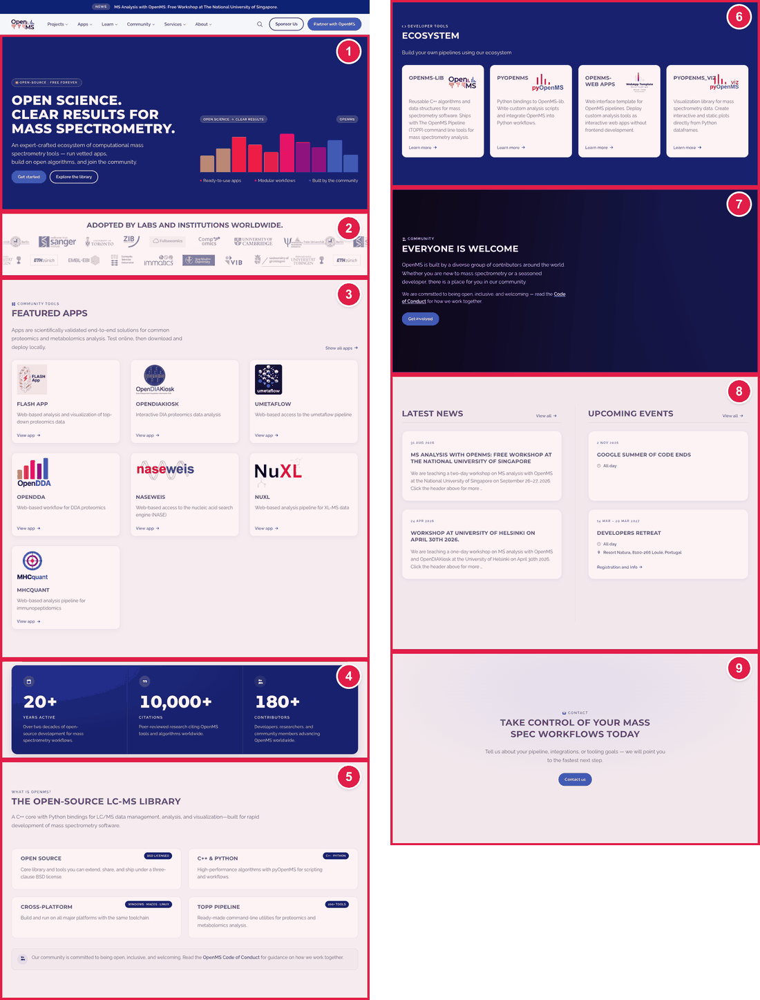
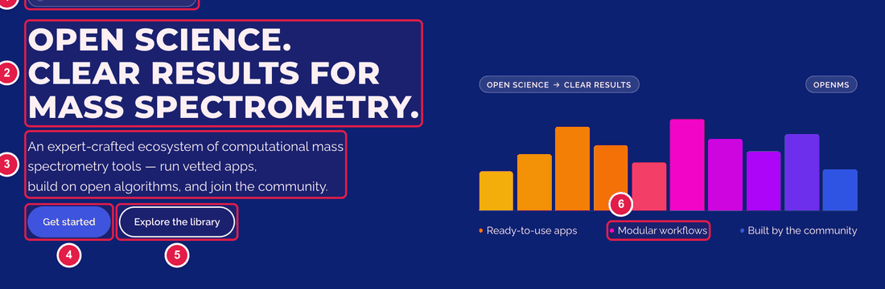
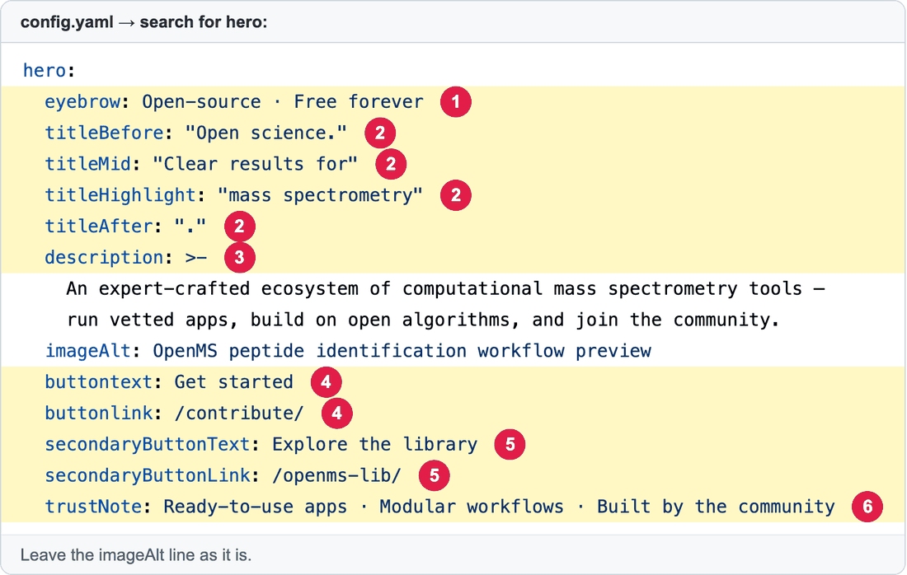
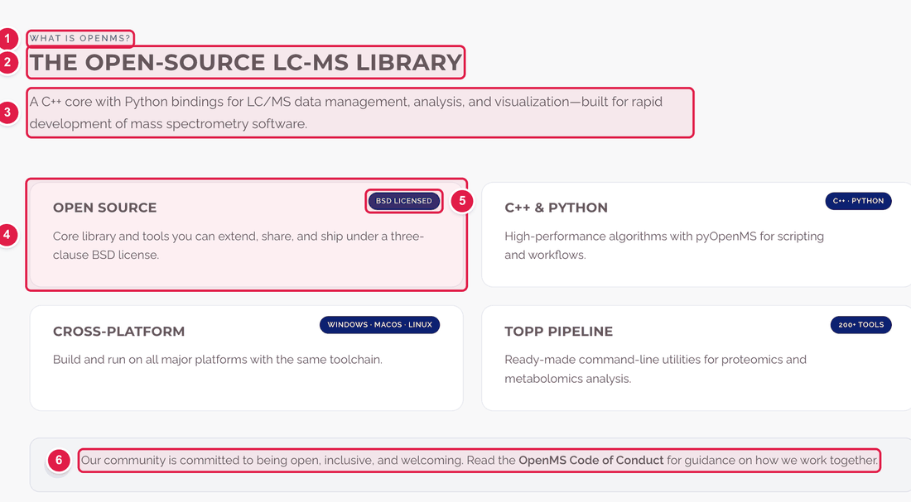
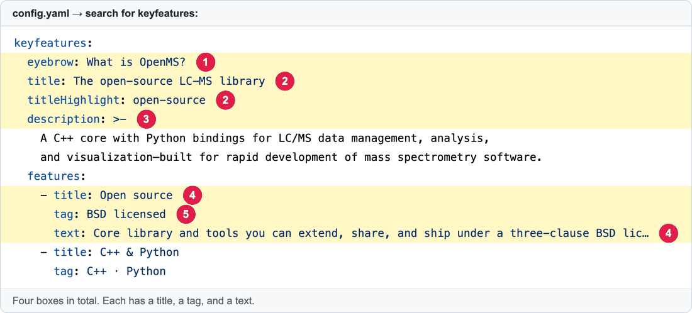
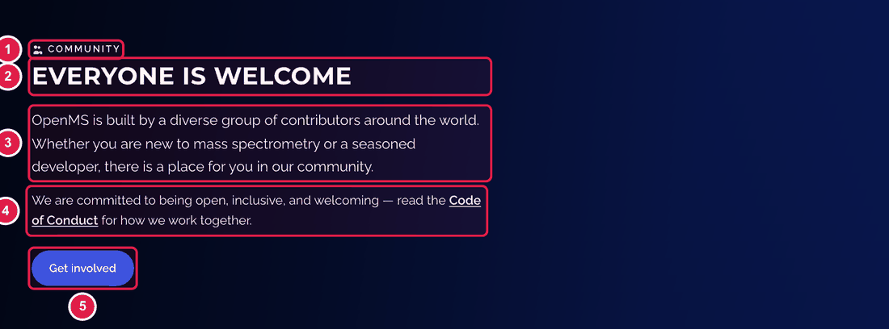
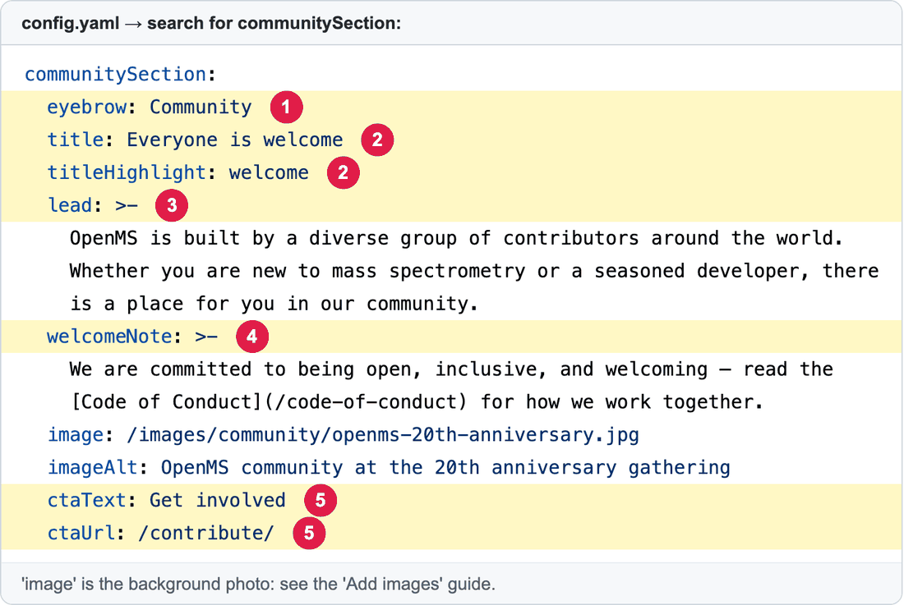

# Edit the text on the home page

The home page (**https://openms.de/**) is built from **blocks**, one under the other. The words in most blocks live in **one file: `config.yaml`**. You find the block you want by searching for a short key word.

**You will change:** a few lines in `config.yaml`  ·  **Time:** about 10 minutes  ·  **Skills needed:** none

## Which block do I want?



| Number | Block on the page | Search for this word in `config.yaml` | Guide |
|:--:|-------------------|--------------------------------------|-------|
| 1 | **Top banner** ("Open science. Clear results…") | `hero:` | [below](#1-the-top-banner-hero) |
| 2 | **Adopted by labs and institutions** (logos) | `universityPartners` | [below](#2-the-logos-adopted-by-labs) |
| 3 | **Featured Apps** | `webapps` | [Update Featured Apps](update-featured-apps.md) |
| 4 | **Three big numbers** (20+, 10,000+, 180+) | `homeMetrics` | [below](#4-the-three-big-numbers) |
| 5 | **What is OpenMS?** (four boxes) | `keyfeatures` | [below](#5-what-is-openms-the-four-boxes) |
| 6 | **Ecosystem** (OpenMS-lib, pyOpenMS…) | `ecosystemSection` | [below](#6-and-8-ecosystem-news-and-events) |
| 7 | **Everyone is welcome** | `communitySection` | [below](#7-everyone-is-welcome) |
| 8 | **Latest news** and **Upcoming events** | `newsSection`, `eventsSection` | [below](#6-and-8-ecosystem-news-and-events) |
| 9 | **"Take control of your mass spec workflows"** (contact) | *not in `config.yaml`* | Ask the web team. |

## How to change any block

The same steps work for every block. Only the key word you search for is different.

1. Open **https://github.com/OpenMS/OpenMS-website/blob/main/config.yaml** and click the **pencil icon**. (Need help? [How to make a change, step 1](../getting-started/edit-via-github.md#step-1--open-the-file))
2. Click once inside the text box, press **Ctrl + F** (Windows) or **Cmd + F** (Mac) and type the key word from the table.
3. Change **only the words after the colon**. Keep the quotes and the spaces at the start of each line. See [Spaces matter](../getting-started/edit-via-github.md#spaces-matter-in-configyaml).
4. Save and send for review: [How to make a change, steps 3 to 6](../getting-started/edit-via-github.md#step-3--save-commit-changes).
5. Open the **Deploy Preview** and check the home page.

> **Tip:** the search often finds the key word in several places. Use the one that **starts at the left** (a line like `hero:` with nothing before it except spaces) and is followed by indented lines.

---

## 1. The top banner (`hero:`)





| Number | Line(s) | What it is |
|:--:|---------|-----------|
| 1 | `eyebrow:` | The small label above the headline. |
| 2 | `titleBefore:`, `titleMid:`, `titleHighlight:`, `titleAfter:` | The headline, in four pieces joined together. `titleHighlight` is shown in a different colour. |
| 3 | `description:` | The paragraph under the headline. Several lines are fine. Keep them indented. |
| 4 | `buttontext:` and `buttonlink:` | The first button: its **words** and **where it goes**. |
| 5 | `secondaryButtonText:` and `secondaryButtonLink:` | The second (outlined) button. |
| 6 | `trustNote:` | The three short phrases under the buttons, separated by `·`. |

**Before**

```yaml
buttontext: Get started
buttonlink: /contribute/
```

**After**

```yaml
buttontext: Download OpenMS
buttonlink: https://openms.readthedocs.io/en/latest/about/installation.html
```

For a link to another page of this website, start with `/` (for example `/contribute/`). For another website, use the full address starting with `https://`.

## 2. The logos "Adopted by labs"

> Full guide with pictures: **[Add, change or remove a logo](update-adopted-by-logos.md)**.

Search for `universityPartners`. Each logo is **one group of three lines**:

```yaml
universityPartners:
  - name: ETH Zürich
    logo: /images/logos/zurich.jpeg
    url: https://imsb.ethz.ch/
```

- **Add a logo:** first add the picture (see [Add images](add-images.md)), then copy one group and change the three lines. Keep the `-` in front of `name`.
- **Remove a logo:** delete its three lines.
- `url` is where people go when they click the logo.

## 4. The three big numbers

> Full guide: **[Change the three big numbers](update-home-metrics.md)**.


| Number | Line | What it is |
|:--:|------|-----------|
| 1 | `value:` and `suffix:` | The big number and what follows it (`+`). Write the number **without commas** (`10000`). The website adds the comma. |
| 2 | `label:` | The small title under the number. |
| 3 | `description:` | The sentence under that. |

## 5. "What is OpenMS?" (the four boxes)





| Number | Line | What it is |
|:--:|------|-----------|
| 1 | `eyebrow:` | Small label above the title. |
| 2 | `title:` and `titleHighlight:` | The title. The highlighted words must also appear in the title. |
| 3 | `description:` | The paragraph under the title. |
| 4 | `title:` and `text:` inside `features:` | The title and text of **one box**. |
| 5 | `tag:` | The little badge inside the box. |
| 6 | `note:` (at the end of the block) | The grey bar at the bottom. A link is written `[words](/page/)`. |

## 7. "Everyone is welcome"





| Number | Line | What it is |
|:--:|------|-----------|
| 1 | `eyebrow:` | Small label. |
| 2 | `title:` and `titleHighlight:` | The headline. The highlighted word must also appear in the title. |
| 3 | `lead:` | The first paragraph. |
| 4 | `welcomeNote:` | The second paragraph. A link is written `[words](/page/)`. |
| 5 | `ctaText:` and `ctaUrl:` | The button's words and where it goes. |

The background photo is the `image:` line. To change it, see [Add images](add-images.md).

## 6 and 8. Ecosystem, news and events

- **Ecosystem** (`ecosystemSection`): `title`, `description`, and the cards under `items:` (each has `name`, `tag`, `description`, `url`).
- **Latest news** column: the **heading** is in `newsSection` (`homeTitle`, `homeViewAllText`). The **articles** are the newest ones from [Add a news article](add-news-post.md). `homeLimit: 4` is how many are shown.
- **Upcoming events** column: the **heading** is in `eventsSection` (`title`, `lead`). The **events** come from the calendar: see [Add or change an event](update-community-calendar.md).

## Common mistakes

| What went wrong | How to fix it |
|-----------------|---------------|
| The preview says **Failed** | A quote or colon is wrong. A text with a `:` inside must be inside double quotes: `"Note: this"`. |
| My text shows twice, or the highlight is missing | `titleHighlight` must be words that really appear in the title. |
| A button goes to the wrong place | `buttonlink` for another website must start with `https://`. For this website it must start with `/`. |
| I can't find the key word | Make sure you clicked inside the text box before pressing Ctrl+F or Cmd+F. |

## Leave these to the web team

The **order** of the blocks and their **colours and spacing** are not in `config.yaml`. If you want them changed, ask. See [Who to ask](../workflow/who-to-ask.md).

## Related guides

- [Update Featured Apps](update-featured-apps.md)
- [Change the announcement bar](update-news-banner.md)
- [Add images](add-images.md)
- Back to the [list of all guides](../README.md)
