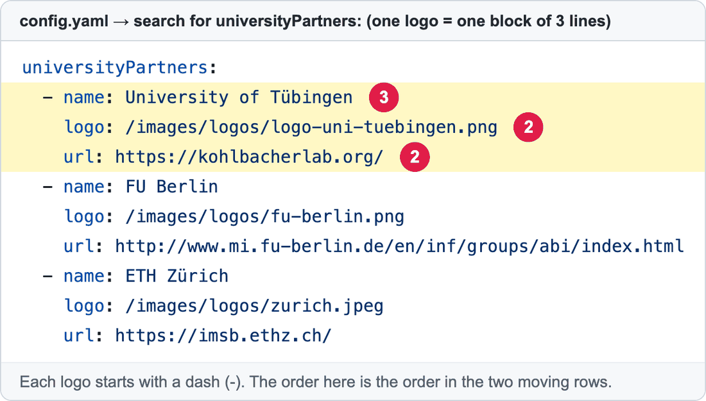

# Add, change or remove a logo in "Adopted by labs and institutions worldwide"

On the **home page**, just under the top banner, two rows of logos slowly move sideways. These are the labs, universities and companies that use OpenMS. Each logo is **one small block** in `config.yaml`, and each logo is a link to that organisation's website.

**You will change:** one block in `config.yaml` and upload one picture  ·  **Time:** about 15 minutes  ·  **Skills needed:** none

## What you will change


1. The heading. It is fixed text, you cannot change it here.
2. **One logo.** Click it and the visitor goes to that organisation's website.

The same logo in `config.yaml`:



| Number | Line | What it is |
|:--:|------|-----------|
| 2 | `logo:` | The picture. Its path starts with `/images/logos/` and ends with the file name you uploaded. |
| 2 | `url:` | The website that opens when someone clicks the logo. |
| 3 | `name:` | The organisation's name. It is **not shown**, but it is read aloud by screen readers and used if the picture fails to load, so please fill it in. |

The logos are split **alternately** between the two rows (1st, 3rd, 5th… on one row; 2nd, 4th, 6th… on the other). So the **order of the list** decides which row a logo lands on and where.

## Add a logo

### Step 1 – Get a good logo picture

- A **PNG** (or SVG) with a **transparent or white background** looks best.
- A **wide** logo (about 3 times wider than tall) fits the rows best.
- Keep it under about **200 KB**.
- File name: small letters, numbers and `-` only, for example `logo-acme-biotech.png`.

### Step 2 – Upload it

Upload the picture to the folder **`static/images/logos/`**. Step-by-step with pictures: [Add images](add-images.md).

### Step 3 – Add the block to `config.yaml`

1. Open **https://github.com/OpenMS/OpenMS-website/blob/main/config.yaml** and click the **pencil icon**. ([Need help?](../getting-started/edit-via-github.md#step-1--open-the-file))
2. Click inside the text box, press **Ctrl + F** (Windows) or **Cmd + F** (Mac), and search for `universityPartners`.
3. Go to the **end of the last logo** (the next heading after the list is `navbarlogo:`). Press **Enter** and paste:

```yaml
        - name: Acme Biotech
          logo: /images/logos/logo-acme-biotech.png
          url: https://www.acme-biotech.example/
```

4. Replace the three values. The spaces at the start of each line must line up **exactly** with the logos above (the `-` starts under the other `-` signs).

> To put the new logo **earlier** in the rows, paste the block higher up in the list instead of at the end.

### Step 4 – Save, send for review, and check

[How to make a change, steps 3 to 6](../getting-started/edit-via-github.md#step-3--save-commit-changes). In the **Deploy Preview**, look at the strip on the home page. Check:

- [ ] The logo appears and is not blurry, cut off, or tiny next to its neighbours.
- [ ] Clicking it opens the right website.

## Change a logo

- **Another website when clicked:** change the `url:` line.
- **A better picture:** upload the new file with a **new name**, then change the `logo:` line to match. Or upload it with the **same name** to replace it (see [Replace a picture](add-images.md#replace-a-picture-that-is-already-there)).
- **The name:** change `name:`.

## Remove a logo

Delete its **three lines** (`- name:`, `logo:`, `url:`). The rows rearrange themselves.

## Common mistakes

| What went wrong | How to fix it |
|-----------------|---------------|
| The preview says **Failed** | The spaces at the start of the lines are wrong. Compare with the block above yours. See [Spaces matter](../getting-started/edit-via-github.md#spaces-matter-in-configyaml). |
| The picture is missing (just a name or an empty box) | The path in `logo:` doesn't match the uploaded file exactly. Capital letters and the ending (`.png` / `.jpg` / `.jpeg`) must match. |
| The logo looks much smaller than the others | The picture has a lot of empty space around it. Crop the empty space away and upload again. |
| The logo has a coloured box around it | Use a PNG with a transparent background. |
| I see the old logo after replacing the file | Your browser remembers it. Refresh the page without the cache (**Ctrl + Shift + R**, or **Cmd + Shift + R** on Mac). |

## Related guides

- [Add images](add-images.md)
- [Edit the text on the home page](edit-homepage-hero.md)
- Back to the [list of all guides](../README.md)
