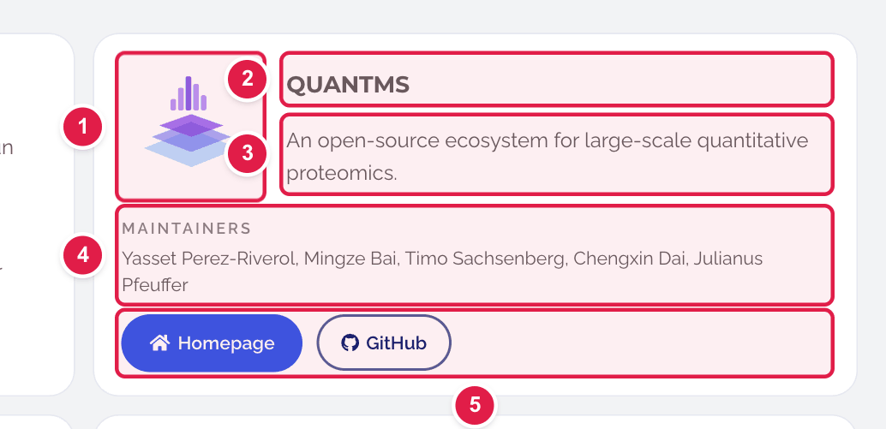
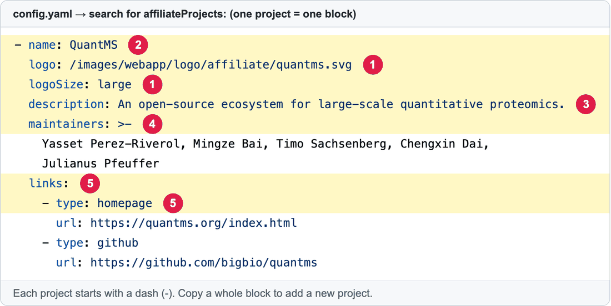

# Add, change or remove an Affiliated App

**Affiliated Apps** are projects from partners and the community that **use OpenMS** but are **not maintained by the OpenMS team** (for example QuantMS, Casanovo, Pyprophet). They appear on **https://openms.de/affiliated-apps/**.

**You will change:** one block in `config.yaml`  ·  **Time:** about 15 minutes  ·  **Skills needed:** none

> Apps the OpenMS team **does** maintain are different: see [Featured Apps](update-featured-apps.md).

## What you will change

One project is one **card**:



and one card is one **block of lines** in `config.yaml`:



| Number | Line | What it is |
|:--:|------|-----------|
| 1 | `logo:` and `logoSize:` | The picture (its path always starts with `/images/…`), and its size: `standard`, `large`, `wide` or `xlarge`. Leave `logoSize` out for the standard size. |
| 2 | `name:` | The project's name. |
| 3 | `description:` | One sentence about the project. |
| 4 | `maintainers:` | The people who look after it. Optional. |
| 5 | `links:` | The buttons. Each is a `- type:` line plus a `url:` line. `type` can be `github`, `homepage` or `pypi`. |

## Change an existing project

1. Open **https://github.com/OpenMS/OpenMS-website/blob/main/config.yaml** and click the **pencil icon**. ([Need help?](../getting-started/edit-via-github.md#step-1--open-the-file))
2. Click inside the text box, press **Ctrl + F** (Windows) or **Cmd + F** (Mac), and search for the project's name.
3. Change the words after the colon. Keep the spaces at the start of each line.
4. Save and send for review: [How to make a change, steps 3 to 6](../getting-started/edit-via-github.md#step-3--save-commit-changes).

## Add a new project

### Step 1 – Upload the logo

Put the picture in the folder **`static/images/webapp/logo/affiliate/`**. See [Add images](add-images.md). Remember the file name.

### Step 2 – Copy a block

In `config.yaml`, search for `affiliateProjects:`. Go to the **end of the last project** (the next heading is `archivedSection:`). Press **Enter** and paste the template below. The spaces at the start of each line must line up with the projects above.

```yaml
        - name: ExampleTool
          logo: /images/webapp/logo/affiliate/exampletool.svg
          logoSize: large
          description: One sentence about what the project does.
          maintainers: Jane Doe, John Smith
          links:
            - type: github
              url: https://github.com/example-org/exampletool
            - type: homepage
              url: https://exampletool.org/
```

### Step 3 – Replace the example text

Change the name, logo file name, description, maintainers and the web addresses. Delete any button you don't need (both of its lines). The **order in the list** is the order on the page.

### Step 4 – Save and send for review

[How to make a change, steps 3 to 6](../getting-started/edit-via-github.md#step-3--save-commit-changes).

### Step 5 – Check the preview

Open the **Deploy Preview**, add **/affiliated-apps/** to the address and check that the logo and buttons work.

## Remove a project

Find its `- name:` line and delete everything up to the next `- name:` line.

## Change the heading and introduction

The text above the cards ("Partner ecosystem / Affiliated Apps / These projects are not directly maintained…") is under `affiliateSection:`, just above `affiliateProjects:`.

## Common mistakes

| What went wrong | How to fix it |
|-----------------|---------------|
| The preview says **Failed** | The spaces are wrong. The new block must start with the same number of spaces as the other `- name:` lines. See [Spaces matter](../getting-started/edit-via-github.md#spaces-matter-in-configyaml). |
| The logo is a broken picture | The path in `logo:` must match the uploaded file name exactly and start with `/images/`. |
| A wide logo is cut or tiny | Try `logoSize: wide` (for long logos) or `large`. |

## Related guides

- [Add images](add-images.md)
- [Featured Apps](update-featured-apps.md)
- Back to the [list of all guides](../README.md)
