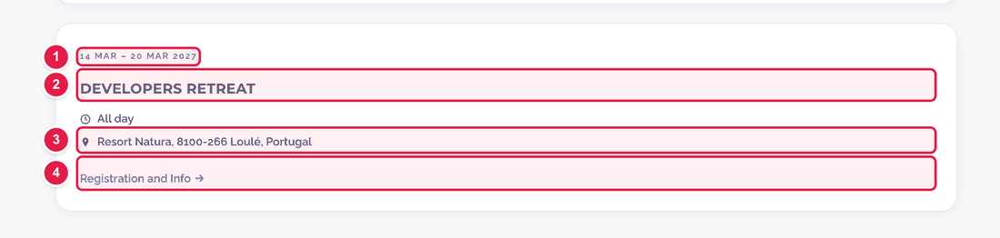
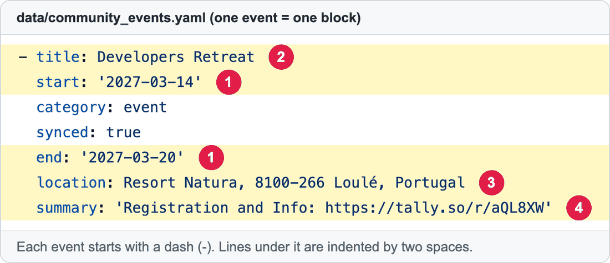

# Add or change an event on the Community calendar

The **Community events** page (**https://openms.de/calendar/**) lists upcoming and past meetings, workshops and outreach events.

There are **two ways** to get an event on that page:

| | Way | Best for |
|--|-----|----------|
| **A** | Type the event into the **shared Google Calendar** (if your team uses it) | People who already use Google Calendar. |
| **B** | Add the event **by hand** in one text file on GitHub | Everyone else. No Google needed. |

**Time:** about 10 minutes  ·  **Skills needed:** none

## What an event looks like



| Number | What it shows | Comes from |
|:--:|---------------|-----------|
| 1 | The date (or date range) | `start:` and `end:` |
| 2 | The event name | `title:` |
| 3 | The place | `location:` |
| 4 | A link (for example to sign up) | a web address inside `summary:` |

## Way B – Add an event by hand (on GitHub)

### Step 1 – Open the events file

Open **https://github.com/OpenMS/OpenMS-website/blob/main/data/community_events.yaml** and click the **pencil icon** at the top right. (Not sure which one? See [How to make a change](../getting-started/edit-via-github.md#step-1--open-the-file).)

### Step 2 – Look at how one event is written

Every event is a small block. Here is a real one:



| Number | Line | What to type |
|:--:|------|--------------|
| 1 | `start:` and `end:` | Dates as `'2027-03-14'` (year-month-day, inside single quotes). `end:` is **only** for events lasting several days. |
| 2 | `title:` | The event name. |
| 3 | `location:` | Place, for example `Helsinki, Finland`. Optional. |
| 4 | `summary:` | One short sentence. If you paste a web address in it, it turns into a link. Optional. |

### Step 3 – Add your event at the end of the list

Scroll to the **last event** in the file. Put your cursor at the very end of that block, press **Enter**, and paste the template below.

> **Careful:** if you see a line starting with `last_synced:` at the very bottom (not indented), paste your event **above** it, not below. It is fine to leave `synced: true` lines of other events alone.

```yaml
- title: My workshop
  start: '2026-11-15'
  end: '2026-11-16'
  location: Berlin, Germany
  category: workshop
  summary: Hands-on OpenMS training. Registration: https://example.org/register
```

Then change the text to your event.

- The first line starts with a **dash and a space** (`- `) at the very start of the line. The lines under it start with **two spaces**. Copy that exactly. See [Spaces matter](../getting-started/edit-via-github.md#spaces-matter-in-configyaml).
- **Do not** add a line `synced: true`. The robot adds that for events it copies from Google.
- `category:` is optional. It picks the colour of the tag. Choose one of: `workshop`, `developer-meeting`, `outreach`, `event`.
- Only one day? Leave out the `end:` line.
- You can leave out `location:` and `summary:` if you do not need them.
- Want the card to link to a news article on this site? Add the line `news_url: /news/my-article/`.

The order of events in the file does not matter. The page sorts them by date.

### Step 4 – Save and send for review

Follow steps 3 to 6 in **[How to make a change](../getting-started/edit-via-github.md#step-3--save-commit-changes)**.

### Step 5 – Check the preview

Open the **Deploy Preview** link on your pull request and add `/calendar/` at the end of the address. Your event should be in the **Upcoming events** list. Events whose date has already passed appear under **Past events** instead.

## Way A – Use the shared Google Calendar

If the web team has connected a Google Calendar to the website, you do **not** need GitHub:

1. Create the event in that Google Calendar (ask the web team for access if you don't have it).
2. Wait up to **15 minutes**. A robot copies the event to the website by itself.

Fill in the Google fields like this:

| Google Calendar field | Appears on the website as | Tip |
|----|----|----|
| Event title | The card heading | Spelling is copied exactly. Titles containing "workshop", "developer meeting" or "summer of code" get a matching coloured tag. |
| Date | The date | For several days, use **All day** and pick the first and the last day. |
| Location | The place | Plain text. |
| Description | The short text | Plain text only. Paste the raw web address if you want a link. It is cut after 160 characters. |

Past events are skipped. If you correct something, **change it in Google Calendar**, not in the file. Events the robot added are overwritten at the next check.

Not sure whether the connection is active? Ask the web team.

## Common mistakes

| What went wrong | How to fix it |
|-----------------|---------------|
| The preview says **Failed** | Check the spaces at the start of each line and the single quotes around the dates. Compare with the real event above your new one. |
| My event is not in the **Upcoming** list | The date is in the past, or has a typo. It must look like `'2026-11-15'`. |
| My change to an event was undone | That event has `synced: true`, so it comes from Google Calendar. Change it there instead. |
| The link in the card doesn't work | Check that the web address in `summary:` starts with `https://`. |

## For the web team (advanced)

These parts are not needed for normal event updates.

### Turn on the Google Calendar connection

`sync_google_calendar.py`, started by `.github/workflows/update_calendar.yml`, copies events from a Google Calendar into `data/community_events.yaml`. It only changes entries marked `synced: true`. It opens and merges a pull request automatically when something changed.

1. In Google Calendar, open **Settings → the calendar → Integrate calendar** and copy **Secret address in iCal format**.
2. Add it on GitHub as the repository secret `GOOGLE_CALENDAR_ICS_URL` (**Settings → Secrets and variables → Actions**).
3. **Treat that address like a password.** It gives read access to the whole calendar. Never paste it into a file, an issue or a pull request.
4. Optional: in `config.yaml` under `calendarSection`, fill in `googleCalendarSubscribeUrl` to show an "Add to Google Calendar" button. The comment above that key explains the format. This public link is different from the secret above.

### Faster updates (optional)

The workflow checks every 15 minutes. To sync within seconds, a Google Apps Script can notify GitHub when an event changes (event type `calendar-updated`). It needs a GitHub token with **Contents: Read and write** stored in the script's private properties.

```js
const REPO = 'OWNER/REPO';                    // e.g. OpenMS/OpenMS-website
const CALENDAR_ID = 'CALENDAR_ID_OR_EMAIL';   // the calendar that feeds the site

function notifyGitHub() {
  UrlFetchApp.fetch('https://api.github.com/repos/' + REPO + '/dispatches', {
    method: 'post',
    contentType: 'application/json',
    headers: {
      Authorization: 'Bearer ' + PropertiesService.getScriptProperties().getProperty('GH_TOKEN'),
      Accept: 'application/vnd.github+json',
    },
    payload: JSON.stringify({ event_type: 'calendar-updated' }),
  });
}

function setup() {
  ScriptApp.newTrigger('notifyGitHub').forUserCalendar(CALENDAR_ID).onEventUpdated().create();
}
```

Never put the token in this repository.

### Where the page's text and layout live

- Headings and section text: `config.yaml` → `calendarSection`
- Layout: `layouts/partials/community-calendar-main.html`
- Styling: `assets/css/community-calendar.css`, `assets/css/calendar-gcal-sync.css`

## Related guides

- [Add a news article](add-news-post.md), to link an event to an article with `news_url`
- Back to the [list of all guides](../README.md)
