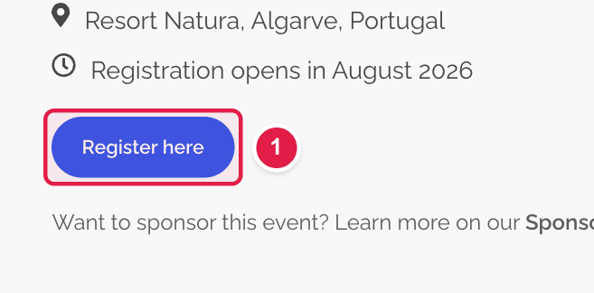

# Update the Developer Retreat page (once a year)

The page **https://openms.de/developer-retreat/** tells people about the next retreat and shows a photo of the last one. Once a year, after a retreat has finished, you update a few lines.

**You will change:** about 15 lines in `config.yaml` and upload up to 2 pictures  ·  **Time:** about 20 minutes  ·  **Skills needed:** none

## What you will change

**The "Upcoming retreat" block**


**The photo of the last retreat** (further down the same page)


**And the matching lines in `config.yaml`** (the numbers are the same):


| Number | Lines | What it is |
|:--:|-------|-----------|
| 1 | each `text:` under `facts:` | The short lines with the date, place and registration note. You can add or delete a line. |
| 2 | `open:`, `url:`, `label:`, `closedHint:` | The registration button (see below). |
| 3 | `src:` under `poster:` | The poster picture. `alt:` right below is its description. |
| 4 | `src:` and `alt:` under `pastPhoto:` | The photo of the retreat that just happened, and its description. |
| 5 | `caption:` | The sentence under that photo. |

## Step by step

### Step 1 – Upload the new pictures

The new poster (and the photo of the retreat that just ended) go in the folder **`static/images/`**. See [Add images](add-images.md). Note the exact file names, for example `dev_retreat_2028_poster.png`.

### Step 2 – Open `config.yaml`

Open **https://github.com/OpenMS/OpenMS-website/blob/main/config.yaml**, click the **pencil icon**, click inside the text box, press **Ctrl + F** (Windows) or **Cmd + F** (Mac) and search for:

```
pastPhoto
```

([Need help?](../getting-started/edit-via-github.md#step-1--open-the-file))

### Step 3 – Move last year's retreat to "past"

- Under `pastPhoto:`: put in the photo of the retreat that just ended, its description (`alt`) and `caption`. Example:

  ```yaml
  pastPhoto:
    src: /images/dev_retreat_2027.jpeg
    alt: OpenMS contributors at the 2027 developer retreat in Portugal
    caption: 2027 Developer retreat at Resort Natura in the Algarve, Portugal
  ```

### Step 4 – Fill in the next retreat

- Under `facts:`, change the three `text:` lines. For example: `March 2028 (dates to be confirmed)`, `Location to be announced`, `Registration opens in early 2028`.
- Under `poster:`, change `src:` to the new poster file and `alt:` to its description. Not ready yet? Ask the web team before removing it.

### Step 5 – Registration button (short version)

| Situation | What to set |
|-----------|-------------|
| Registration **not open yet** | `open: false`. Write the pop-up message in `closedHint:`. |
| Registration **is open** | `open: true` and put the sign-up address in `url:` between the quotes, for example `url: "https://tally.so/r/abc123"`. |

### Step 6 – Save, send for review, and check

[How to make a change, steps 3 to 6](../getting-started/edit-via-github.md#step-3--save-commit-changes). In the **Deploy Preview**, add **/developer-retreat/** to the address and check:

- [ ] The dates and place are right.
- [ ] The poster shows and is not cut.
- [ ] The register button does what you expect.

> The retreat also shows in the **Community calendar**. See [Add or change an event](update-community-calendar.md).

## Replace the photos (poster and last retreat's photo)

There are **two pictures** on the page:

- the **poster** (3 in the pictures above), next to the dates of the upcoming retreat;
- the **photo of the last retreat** (4), further down.

You have two ways to replace a picture:

| Way | When to use it | What to do |
|-----|----------------|------------|
| **A. Same file name** | You only want a new picture in the same place. | Rename your new picture to the **exact name of the old one** (for example `dev_retreat_2026.jpeg`) and upload it to `static/images/`. GitHub replaces the old one. Nothing in `config.yaml` changes. See [Replace a picture](add-images.md#replace-a-picture-that-is-already-there). |
| **B. New file name** | You are putting up the next year's picture, or the ending is different (`.png` instead of `.jpeg`). | Upload the new picture with a **new name** (for example `dev_retreat_2027.jpeg`) to `static/images/`. Then, in `config.yaml`, change the `src:` line to the new name, and update `alt:` and `caption:` too. |

Good to know:

- Use a **JPEG** for photos and a **PNG** for posters. Keep the files **under about 1 MB**.
- The poster is shown **as a whole** on the page, so any shape works, but a portrait or square poster looks best.
- If you don't have a poster yet, ask the web team before deleting the `poster:` lines.

## Update the "Register here" link



1. The **Register here** button. When registration is **open** it is a normal blue button that opens your sign-up form in a new tab. When it is **closed** the button does nothing when clicked, and the `closedHint:` text appears in a small pop-up when you point at it.

In `config.yaml`, the lines are (number 2 in the picture of the config lines above):

```yaml
registration:
  open: true
  url: "https://tally.so/r/your-form"
  label: Register here
  closedHint: Registration will open August 2026
```

| Line | What to type |
|------|--------------|
| `open:` | `true` to turn the button on, `false` to turn it off. Write it **without quotes**. |
| `url:` | The full address of the sign-up form. **Keep the quotes**. It must start with `https://`. |
| `label:` | The words on the button. |
| `closedHint:` | The message that pops up when someone points at the button while `open: false`. |

**Steps**

1. Open `config.yaml` in the editor, search for `registration:` and find the lines under `developerRetreatPage`. (Several places may match: choose the one that is followed by `open:`.)
2. Change `open: false` to `open: true`. (The button only turns on when **both** `open: true` **and** an address in `url:` are present.)
3. Paste the form address between the quotes of `url:`.
4. Save and send for review, then use the **Deploy Preview** to click the button and make sure the right form opens.

> Also update the date lines under `facts:` ("Registration opens in August 2026") so the page does not say registration is closed when it is open.

## Parts that rarely change

`eyebrow`, `pageTitle`, `about` and `highlights` describe the retreat in general. You don't need to change them every year. Leave `headline` to the web team (it contains hidden formatting).

## Common mistakes

| What went wrong | How to fix it |
|-----------------|---------------|
| The preview says **Failed** | A `text:` line with a colon in it needs quotes: `text: "Dates: March 2028"`. See [Spaces matter](../getting-started/edit-via-github.md#spaces-matter-in-configyaml). |
| A picture is broken | The `src:` path must match the uploaded file exactly (capital letters count) and start with `/images/`. |
| The register button still says closed | `open:` must be `true` (no quotes) and `url:` must have an address. |
| The old photo is still showing | Refresh without the cache (**Ctrl + Shift + R**, or **Cmd + Shift + R** on Mac). If it is still there, the new file name does not match the old one exactly. |

## Related guides

- [Add images](add-images.md)
- Back to the [list of all guides](../README.md)
