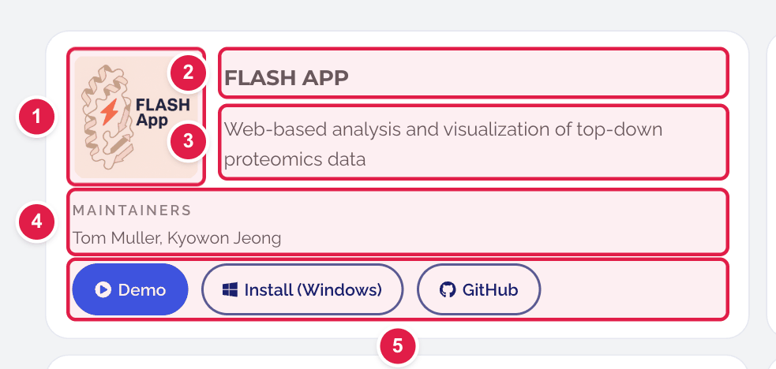
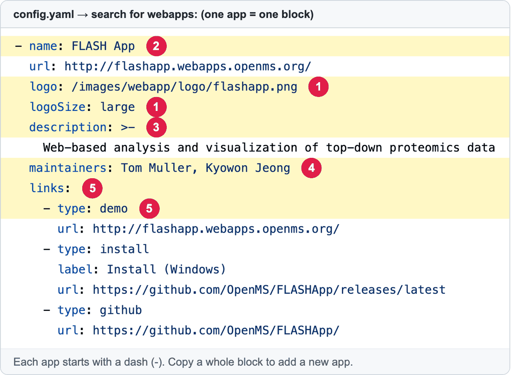

# Add, change or remove a Featured App

**Featured Apps** are the web apps that the OpenMS team looks after (FLASH App, OpenDIAKiosk, NuXL…). They appear in **two places**, both from one list in `config.yaml`:

- the **home page**, block "Featured Apps";
- the page **https://openms.de/featured-apps/**, with more details.

**You will change:** one block in `config.yaml`  ·  **Time:** about 15 minutes  ·  **Skills needed:** none

> Apps that the OpenMS team does **not** maintain go in [Affiliated Apps](update-affiliated-apps.md).

## What you will change

One app is one **card**:



And one card is one **block of lines** in `config.yaml`:



| Number | Line | What it is |
|:--:|------|-----------|
| 1 | `logo:` and `logoSize:` | The picture. `logo` is its place in the website (always starts with `/images/…`). `logoSize` can be `standard`, `large` or `xlarge`. Use a bigger size if the logo looks small next to the others. |
| 2 | `name:` | The app's name. |
| 3 | `description:` | One sentence about the app. |
| 4 | `maintainers:` | Who looks after the app. Optional. |
| 5 | `links:` | The buttons: **Demo**, **Install**, **GitHub**. Each button is two or three lines (see below). |

The `url:` line (just under `name:`) is the app's main web address.

## Change an existing app

1. Open **https://github.com/OpenMS/OpenMS-website/blob/main/config.yaml** and click the **pencil icon**. ([Need help?](../getting-started/edit-via-github.md#step-1--open-the-file))
2. Click inside the text box, press **Ctrl + F** (Windows) or **Cmd + F** (Mac) and search for the **app's name**, for example `NuXL`.
3. Change the words after the colon. Keep the spaces at the start of each line.
4. Save and send for review: [How to make a change, steps 3 to 6](../getting-started/edit-via-github.md#step-3--save-commit-changes).

## Add a new app

### Step 1 – Upload the logo

Upload the picture first (a square-ish `.png` or `.svg` works best). Put it in the folder **`static/images/webapp/logo/`**. The how-to is in [Add images](add-images.md). Remember the file name, for example `mynewapp.png`.

### Step 2 – Copy a block

1. Open `config.yaml` in the editor (as above) and search for `webapps:`.
2. Find the **last app** in the list (the next heading after the list is `affiliateSection`).
3. Put your cursor at the end of that last app, press **Enter**, and paste the template below. Keep the spaces at the start of each line **exactly** as in the template, because they must line up with the apps above.

```yaml
        - name: MyNewApp
          url: https://mynewapp.webapps.openms.org/
          logo: /images/webapp/logo/mynewapp.png
          logoSize: large
          description: One sentence about what the app does.
          maintainers: Your Name
          links:
            - type: demo
              url: https://mynewapp.webapps.openms.org/
            - type: install
              label: Install (Windows)
              url: https://github.com/OpenMS/mynewapp/releases/latest
            - type: github
              url: https://github.com/OpenMS/mynewapp
```

### Step 3 – Replace the example text

Change `MyNewApp`, the web addresses, the logo file name, the description, and the maintainers.

- No Windows installer? Delete the three lines of `type: install`.
- No `maintainers`? Delete that line.
- The **order** in the list is the order on the website. Put your app where you want it.

### Step 4 – Save and send for review

[How to make a change, steps 3 to 6](../getting-started/edit-via-github.md#step-3--save-commit-changes).

### Step 5 – Check the preview

Open the **Deploy Preview** and look at **/featured-apps/** and at the home page. Check:

- [ ] The logo shows and is not tiny or blurry.
- [ ] Each button opens the right page.

## Remove an app

Find its block in `config.yaml`, starting at its `- name:` line, and **delete everything up to the next `- name:`** (the next app).

## Change the block's heading text

The big heading and the introduction above the apps ("Community tools / Featured Apps / Apps are scientifically validated…") are under `webappsSection:`, just above `webapps:`. Change the words after the colons.

## Common mistakes

| What went wrong | How to fix it |
|-----------------|---------------|
| The preview says **Failed** | The spaces are wrong. The new block must start with exactly the same number of spaces as the other `- name:` lines. See [Spaces matter](../getting-started/edit-via-github.md#spaces-matter-in-configyaml). |
| The logo is a broken picture | The path in `logo:` must match the uploaded file name exactly (capital letters count) and start with `/images/`. |
| The logo looks too small | Change `logoSize: large` to `xlarge`. |
| A button is missing | Each button needs its own `- type:` and `url:` lines. |

## Related guides

- [Add images](add-images.md)
- [Affiliated Apps](update-affiliated-apps.md)
- Back to the [list of all guides](../README.md)
