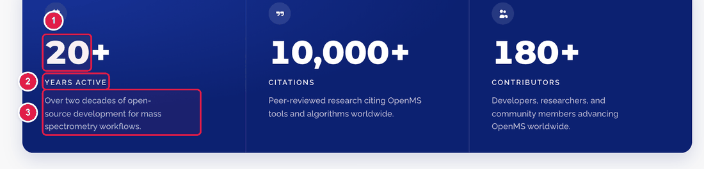
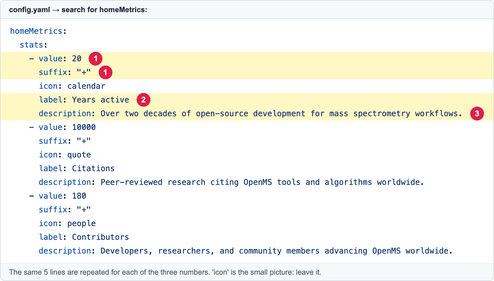

# Change the three big numbers on the home page

On the home page, in a dark blue panel, there are three big numbers: **20+ Years active**, **10,000+ Citations**, **180+ Contributors**. Each number is one small block in `config.yaml`.

**You will change:** a few lines in `config.yaml`  ·  **Time:** about 5 minutes  ·  **Skills needed:** none

## What you will change



1. The **number** (and what comes after it, like `+`).
2. The **label** under the number.
3. The **sentence** under the label.

And the same block in `config.yaml`:



| Number | Line | What it is |
|:--:|------|-----------|
| 1 | `value:` | The number. **Digits only, no commas** (`10000`, not `10,000`). The website adds the comma and counts up to it when the page loads. |
| 1 | `suffix:` | What comes right after the number, for example `"+"`. Keep the quotes. Leave it as `""` for nothing. |
| 2 | `label:` | The small title under the number. |
| 3 | `description:` | The sentence under that. |
| – | `icon:` | The little picture above the number. Choose one of: `calendar`, `quote`, `people`, `code`, `grid`, `heart`, `help`, `lock`, `mail`, `news`, `shield`, `spark`, `terminal`, `wrench`. |

## Step by step

1. Open **https://github.com/OpenMS/OpenMS-website/blob/main/config.yaml** and click the **pencil icon**. ([Need help?](../getting-started/edit-via-github.md#step-1--open-the-file))
2. Click inside the text box, press **Ctrl + F** (Windows) or **Cmd + F** (Mac), and search for `homeMetrics`.
3. Change the words after the colon. **Before**:

   ```yaml
   - value: 180
     suffix: "+"
     icon: people
     label: Contributors
     description: Developers, researchers, and community members advancing OpenMS worldwide.
   ```

   **After** (a new count and a new description):

   ```yaml
   - value: 200
     suffix: "+"
     icon: people
     label: Contributors
     description: Developers, researchers, and community members from around the world.
   ```

4. Save and send for review: [How to make a change, steps 3 to 6](../getting-started/edit-via-github.md#step-3--save-commit-changes).
5. In the **Deploy Preview**, scroll down on the home page to the blue panel. Check that the numbers count up and the text fits.

## Useful details

- **A decimal number** (like a version `3.5`): write `value: 3.5` and add a line `decimals: 1`.
- **Something in front of the number** (like `$`): add `prefix: "$"`.
- **Add a fourth number or remove one:** copy or delete a whole block of five lines (it starts with `- value:`). The panel was designed for **three**, so check the preview carefully.
- Descriptions should stay **short** (about 12 to 15 words) so the three cards stay the same height.

## Common mistakes

| What went wrong | How to fix it |
|-----------------|---------------|
| The preview says **Failed** | The spaces at the start of the lines are wrong, or a quote is missing around `"+"`. See [Spaces matter](../getting-started/edit-via-github.md#spaces-matter-in-configyaml). |
| The number shows as `10` instead of `10,000` | You wrote `10,000` with a comma. Write `10000`. |
| The icon is missing | The `icon:` name is not in the list above (check the spelling). |
| The numbers don't count up | They count up when you scroll to them. In the preview, scroll down slowly. |

## Related guides

- [Edit the text on the home page](edit-homepage-hero.md)
- Back to the [list of all guides](../README.md)
