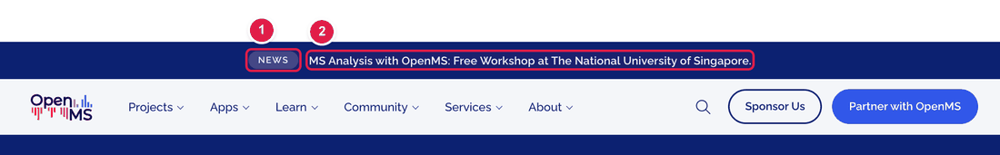
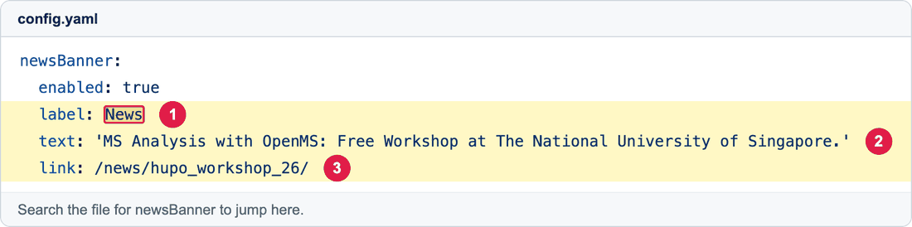

# Change the announcement bar at the top of the website

The dark blue strip at the very top of **every page** is called the **news banner**. Use it for one short, important message, like an upcoming workshop.

**You will change:** a few lines in `config.yaml`  ·  **Time:** about 5 minutes  ·  **Skills needed:** none

## What you will change



1. **The small label** on the left (for example `News`).
2. **The message** next to it.

If you add a link (see below), the **whole strip** becomes clickable.

## Step by step

### Step 1 – Open `config.yaml`

Open **https://github.com/OpenMS/OpenMS-website/blob/main/config.yaml** and click the **pencil icon** at the top right. (Not sure which one? See [How to make a change](../getting-started/edit-via-github.md#step-1--open-the-file).)

### Step 2 – Find the banner lines

Click once inside the text box, press **Ctrl + F** (Windows) or **Cmd + F** (Mac), and search for:

```
newsBanner
```

You will find a small group of lines that looks like this:



| Number | Line | What it does |
|:--:|------|--------------|
| 1 | `label:` | The small label (leave it as `News` unless you have a good reason). |
| 2 | `text:` | **The message people read.** This is the line you will change most often. |
| 3 | `link:` | The page that opens when someone clicks the banner. Leave it empty (`""`) if you don't want a link. |

### Step 3 – Type your new message

Change **only the text between the quotes** on the `text:` line.

**Before**

```yaml
text: 'MS Analysis with OpenMS: Free Workshop at The National University of Singapore.'
```

**After**

```yaml
text: "OpenMS 3.5 is out. Read what is new!"
link: /news/release3.5/
```

Tips:

- Keep it **short** (one line on a phone is about 50 characters).
- Keep the **quotes** around your message. They are needed if your message contains a colon (`:`).
- For `link:`, use the part of the address after `openms.de`. For example, the news article at `https://openms.de/news/release3.5/` becomes `/news/release3.5/`.

### Step 4 – Save and send for review

Follow steps 3 to 6 in **[How to make a change](../getting-started/edit-via-github.md#step-3--save-commit-changes)**:
**Commit changes… → Create a new branch… → Propose changes → Create pull request.**

### Step 5 – Check the preview

Open the **Deploy Preview** link on your pull request and look at the very top of the home page. Your new message should be there.

## Hide the banner completely

Find the `enabled:` line (just under `newsBanner:`) and change `true` to `false`:

```yaml
newsBanner:
  enabled: false
```

Change it back to `true` when you want the banner again.

## Common mistakes

| What went wrong | How to fix it |
|-----------------|---------------|
| The website didn't build after my change | Check that you kept the **quotes** and did not change the **spaces** at the start of the lines. See [Spaces matter](../getting-started/edit-via-github.md#spaces-matter-in-configyaml). |
| The banner is gone | `enabled` is set to `false`. Set it to `true`. |
| Clicking the banner opens a wrong page | Check the `link:` line. It should start with `/` (for example `/news/my-post/`). |

## Related guides

- Write the full article that the banner links to: [Add a news post](add-news-post.md)
- Back to the [list of all guides](../README.md)
