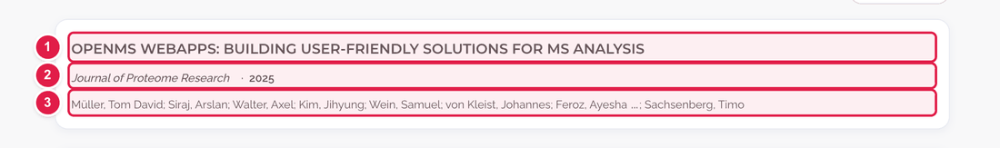
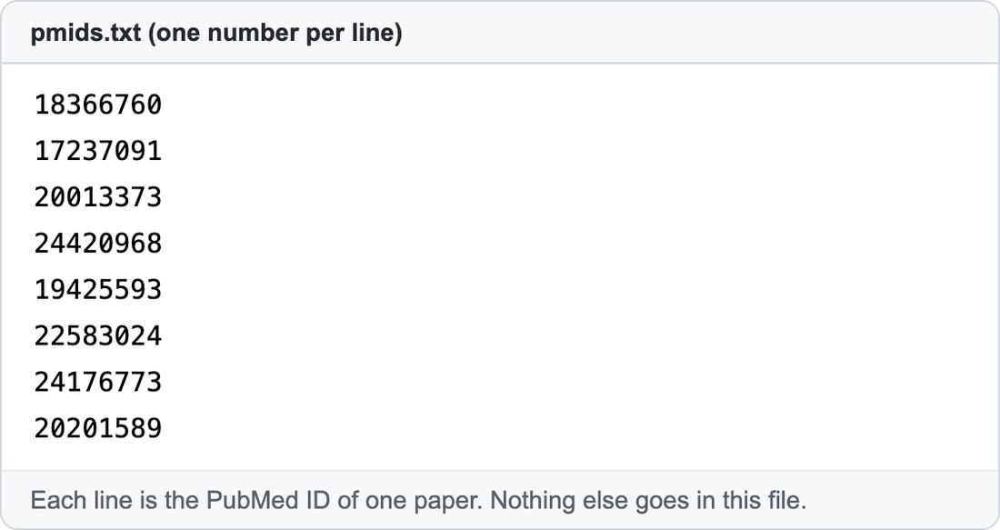

# Add or remove a paper on the Publications page

The page **https://openms.de/publications/** has two parts:

1. **Key publications**: the two papers at the top that people should cite. They are changed by hand (ask the web team: see the end of this page).
2. **All publications**: the long list by year. **This list builds itself** from a file of PubMed numbers. You only add a number.

**You will change:** one line in `pmids.txt`  ·  **Time:** about 10 minutes  ·  **Skills needed:** none

## What you will change

Every paper in the archive looks like this:

| Number | What it shows |
|:--:|---------------|
| 1 | The title (a link to the paper) |
| 2 | The journal and the year |
| 3 | The authors |

**You do not type any of this.** A robot reads the paper's **PubMed ID** and fetches the title, journal, year and authors from PubMed (the free database of life-science papers).

## Add a paper

### Step 1 – Find the PubMed ID

1. Go to **https://pubmed.ncbi.nlm.nih.gov/** and search for the paper's title.
2. Open the paper. Under the title you see **PMID:** followed by a number, for example `38366242`. That number is also at the end of the page's web address. Copy it.

No PubMed entry? Then the paper cannot be added with this method. Ask the web team.

### Step 2 – Add it to `pmids.txt`

1. Open **https://github.com/OpenMS/OpenMS-website/blob/main/pmids.txt** and click the **pencil icon**. ([Need help?](../getting-started/edit-via-github.md#step-1--open-the-file))
2. The file is just numbers, one per line:

   

3. Click at the **very end of the last line**, press **Enter**, and type or paste your number on the new line. Nothing else, no spaces and no text.
4. Save and send for review: [How to make a change, steps 3 to 6](../getting-started/edit-via-github.md#step-3--save-commit-changes). A good note is *Add paper PMID 38366242*.

### Step 3 – Wait for the second, automatic step

Adding the number is only half of it. After the web team **merges your pull request**:

1. A robot starts by itself and fetches the paper's details.
2. It opens a **second pull request** titled **"Automated publications update"**.
3. When the web team merges that one, the paper appears on the website.

So the paper does **not** show up on the website the moment your pull request is merged. If you wait a day and it is still missing, tell the web team.

## Remove a paper

Open `pmids.txt`, delete the line with the number (the whole line), and save as above. The robot's second pull request removes it from the page.

## Common mistakes

| What went wrong | How to fix it |
|-----------------|---------------|
| I see no change after my pull request was merged | Wait for the robot's "Automated publications update" pull request to be merged. See Step 3. |
| The number I added is not found | Check it is the PMID (digits only), not a DOI such as `10.1038/…`. |
| I typed the title instead of the number | Delete it. Only numbers belong in `pmids.txt`. |

## For the web team (advanced)

- The robot is `.github/workflows/update_publications.yml`. It runs when `pmids.txt` changes on `main`, every Sunday at 06:00 UTC, and on demand (**Actions → Update Publications List → Run workflow**). It runs `generate_bib.py` and rewrites `content/en/publications.md`. The resulting pull request is **not merged automatically**.
- The **Key publications** cards are written by hand in `layouts/partials/publications-key.html`: each `<li>` holds one paper's title, link, journal, year and authors. Copy an existing block and change the text only.
- The Google Scholar button text and link: `config.yaml` → `publicationsPage`.

## Related guides

- Back to the [list of all guides](../README.md)
