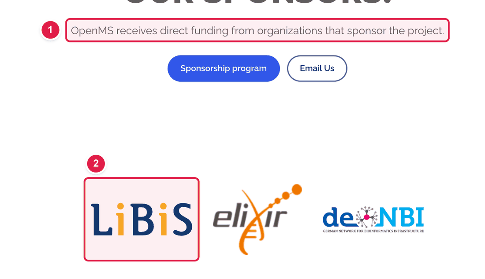
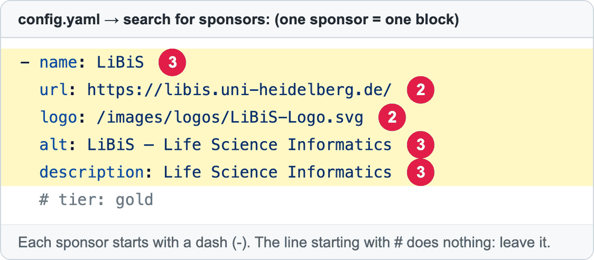

# Add, change or remove a sponsor logo

Sponsors are shown on **https://openms.de/our-sponsors/**. Each sponsor is **one logo** that links to the sponsor's website.

**You will change:** one block in `config.yaml`  ·  **Time:** about 15 minutes  ·  **Skills needed:** none

## What you will change



1. **The introduction** sentence. This is the `intro:` line under `sponsorsSection:`.
2. **One sponsor logo.** Each logo is one block under `sponsors:`.

And this is the block for **one** sponsor in `config.yaml`:



| Number | Line | What it is |
|:--:|------|-----------|
| 2 | `logo:` and `url:` | The picture (its path always starts with `/images/…`), and the website that opens when someone clicks it. |
| 3 | `name:`, `alt:`, `description:` | Not shown as text. They describe the logo for people who use screen readers and for search engines. Please fill them in. |

## Add a sponsor

### Step 1 – Upload the logo

Put the logo in the folder **`static/images/logos/`**. See [Add images](add-images.md). Remember the file name, for example `example-institute.svg`. A `.svg` or a `.png` with a transparent background looks best.

### Step 2 – Add the block

1. Open **https://github.com/OpenMS/OpenMS-website/blob/main/config.yaml** and click the **pencil icon**. ([Need help?](../getting-started/edit-via-github.md#step-1--open-the-file))
2. Click inside the text box, press **Ctrl + F** (Windows) or **Cmd + F** (Mac), and search for `sponsors:`. (The first match may be a different one. Pick the one with `- name: LiBiS` below it.)
3. Go to the end of the **last sponsor** (the line `# tier: silver` or the one before the line `sponsorshipProgram:`). Press **Enter** and paste:

```yaml
          - name: Example Institute
            url: https://example.org/
            logo: /images/logos/example-institute.svg
            alt: Example Institute logo
            description: Supporting open-source proteomics research
```

4. Replace the example text with the real details. Keep the spaces at the start of each line **exactly** as above. They must line up with the sponsors above.

### Step 3 – Save and send for review

[How to make a change, steps 3 to 6](../getting-started/edit-via-github.md#step-3--save-commit-changes).

### Step 4 – Check the preview

Open the **Deploy Preview**, add **/our-sponsors/** to the address and check that the logo looks right and opens the right website.

## Remove a sponsor

Find the sponsor's `- name:` line and delete it together with the lines under it, up to the next `- name:` (or the next heading).

## Change the text on the page

Under `sponsorsSection:` (just above `sponsors:`):

| Line | Where it shows |
|------|----------------|
| `intro:` | The sentence under the page title. |
| `contactCta:` | The text in the dark blue "Become a sponsor" box lower down. |
| `contactButtonText:` / `contactButtonUrl:` | The words and the e-mail address of the **Email Us** button. |

## Group sponsors by level (optional)

Don't do this unless you were asked to. Sponsors are shown as one row of logos. To group them as Platinum / Gold / Silver / Bronze:

1. In each sponsor block, remove the `#` and the space in front of `tier:` and choose `platinum`, `gold`, `silver` or `bronze`.
2. Under `sponsorsSection:`, remove the `#` in front of `groupByTier: true`.

## Common mistakes

| What went wrong | How to fix it |
|-----------------|---------------|
| The preview says **Failed** | The spaces are wrong. The new block must start with the same number of spaces as the other `- name:` lines. See [Spaces matter](../getting-started/edit-via-github.md#spaces-matter-in-configyaml). |
| The logo is a broken picture | The path in `logo:` must match the uploaded file exactly (capital letters count) and start with `/images/`. |
| The logo is huge or tiny | Use a different logo file, or ask the web team to adjust it. |

## Related guides

- [Add images](add-images.md)
- Back to the [list of all guides](../README.md)
