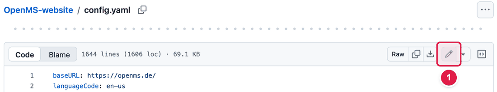
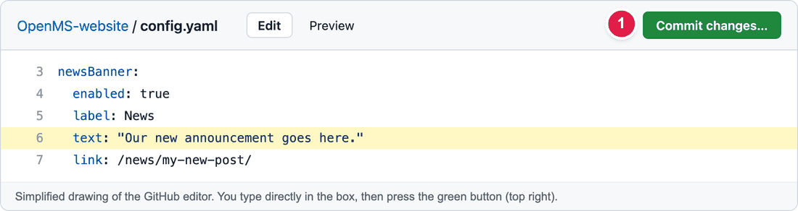
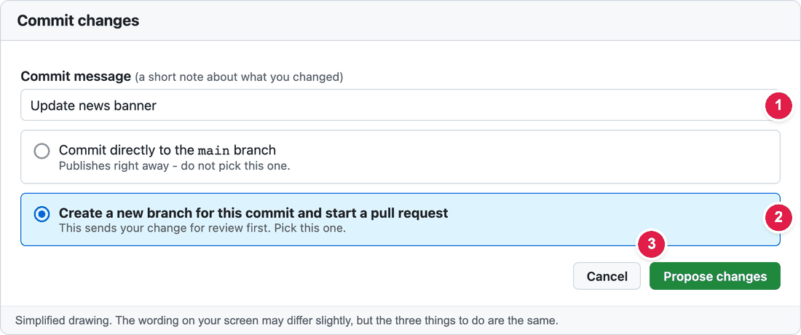
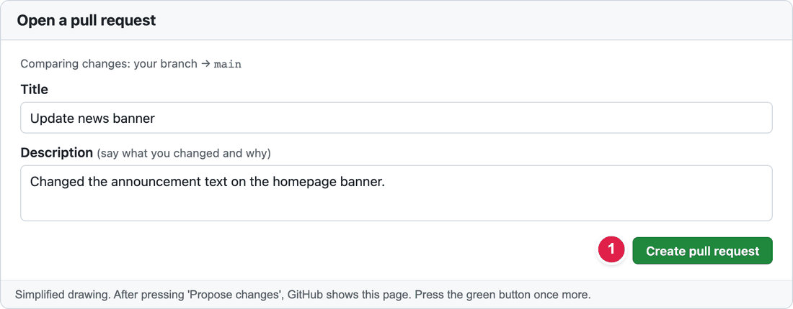
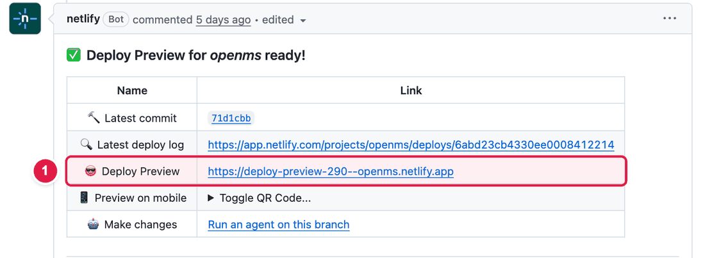
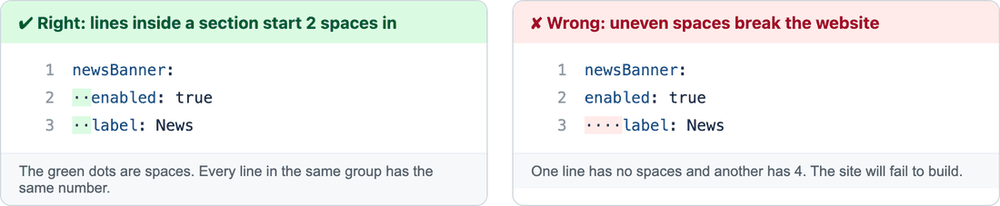

# How to make a change (no coding, nothing to install)

You can update most of the website **using only your web browser**. Nothing you do goes live straight away: every change is **checked by the web team first**, so you cannot break the site by accident.

> **This page is the "saving" part that every guide in [common tasks](../common-tasks/) points to.** Each guide tells you *what* to change. This page shows you *how to save it and send it for review*.

## Before you start

- You need a free **GitHub account** (https://github.com/signup). GitHub is the website where our website files are stored.
- That's it. You do **not** need to install anything.

## Words you will see (and what they mean)

| Word | What it means in plain English |
|------|--------------------------------|
| **Repository** ("repo") | The folder on GitHub that holds all the files of the website. |
| **`config.yaml`** | One big text file that holds most of the website's wording (headlines, buttons, lists of apps, footer links…). |
| **Markdown file** (`.md`) | A simple text file for a page or news article. |
| **Commit** | Saving your change. |
| **Pull request** (PR) | A message to the web team that says *"Please look at my change and publish it if it looks good."* |
| **Preview** | A temporary copy of the website that shows your change, so you can check it before it goes live. |
| **Merge** | The web team approves your pull request. The change then goes live automatically after a few minutes. |

## The 6 steps

### Step 1 – Open the file

Each guide tells you which file to open (for example `config.yaml`). Open the file on GitHub, then click the **pencil icon** at the top right of the file.

1. The **pencil** you click to start editing.

> **GitHub says "You need to fork this repository"?** That is normal if you are not a member of the OpenMS team yet. Click **Fork this repository** and carry on. GitHub makes your own safe copy to work in.

### Step 2 – Make your change

The file opens in a text box. Click where you want to change something and type, just like in a Word document.

- **Looking for a word in a very long file?** Click once inside the text box, then press **Ctrl + F** (Windows) or **Cmd + F** (Mac) and type the word. Each guide tells you the exact word to search for.
- Change **only the text you need**. Do not delete the little symbols around it (quotes, dashes, colons).
- Read [Spaces matter](#spaces-matter-in-configyaml) below if you edit `config.yaml`.

### Step 3 – Save ("Commit changes")

Click the green **Commit changes…** button (top right).

1. The green button you press when you have finished typing.

A small window opens. Do these three things:

1. Write a **short note** about what you changed, e.g. *Update news banner*.
2. Choose **Create a new branch for this commit and start a pull request**. ⚠️ Do **not** choose "Commit directly to the main branch".
3. Click the green **Propose changes** button.

### Step 4 – Send it for review ("Create pull request")

GitHub now shows a page called **Open a pull request**. Press the green **Create pull request** button.

1. The green button that sends your change to the web team.

### Step 5 – Check the preview

After 2–5 minutes, a robot called **netlify** writes a message on your pull request. Click the link next to **Deploy Preview**. It opens a copy of the website that includes your change.

1. Click this link to see your change.

Look at the page you changed. Does it look right? If not, go back to Step 1, edit again, and save again. Your pull request updates by itself.

### Step 6 – Wait for approval

Someone from the web team will check your pull request and **merge** it. After a few minutes your change is on the real website. You can ask who to contact in [Who to ask](../workflow/who-to-ask.md).

---

## Spaces matter in `config.yaml`

`config.yaml` uses **spaces at the start of a line** to group things together. If the spaces are wrong, the website cannot be built.

Simple rules:

1. **Only use the space bar.** Never use the Tab key.
2. **Do not change the spaces at the start of a line.** Type your new text after the colon, and leave everything to the left alone.
3. **Put your text in double quotes** like `"this"`. This is especially important if your text contains a colon (`:`), a `#`, or starts with a special character.
4. If your text contains a **double quote** ("), ask the web team to help.

## I made a mistake – what now?

Don't worry. **Nothing is live until someone merges your pull request.**

- *Small mistake:* open your pull request → **Files changed** → click the **…** menu on the file → **Edit file**, fix it and save again.
- *Big mistake:* at the bottom of your pull request click **Close pull request**. Then start again from Step 1.

## If the preview says "Failed" or never appears

Most of the time this means the spaces or quotes in `config.yaml` are wrong. Compare your lines with the line above and below, and check that nothing was deleted by mistake. See [Common errors](../troubleshooting/common-errors.md) or ask the web team.

## Prefer to try it on your own computer?

You can see changes on your own computer before sending them (this is optional and a bit more technical): [Preview locally](preview-locally.md).
