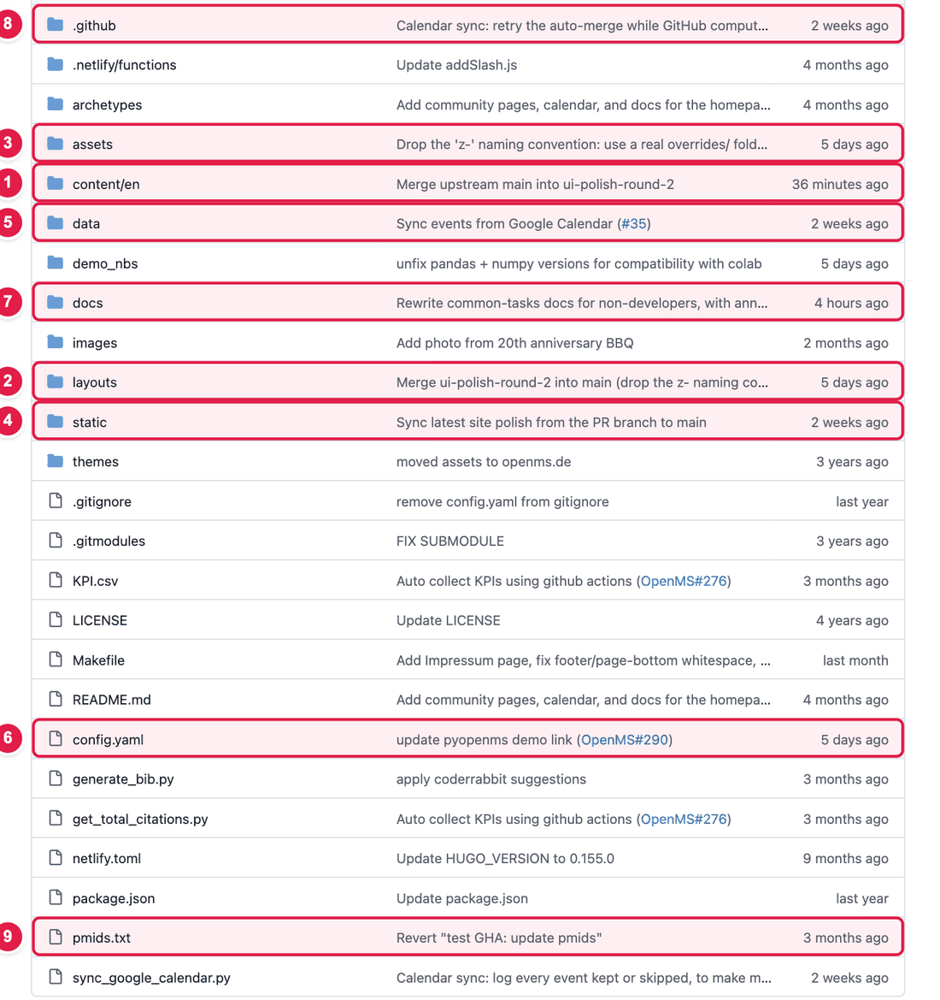

# Where things are in the website's files (a map of the repository)

The website's files are all stored in one place on GitHub, called the **repository** ("repo"). This page is a map. It tells you **which folder holds what**, so you know where to look for a page, a picture, or the styling (colours, spacing).

> **Reading is safe.** Opening folders and files on GitHub changes nothing. Only press the **pencil icon** when you want to edit, and every edit goes through [review](edit-via-github.md) before it goes live.

## The big picture

| Number | Folder or file | What is inside | Can I edit it? |
|:--:|---------------|----------------|----------------|
| 1 | **`content/en/`** | **The pages.** One text file per page (`impressum.md`, `code-of-conduct.md`…) and the news articles in `news/`. | **Yes** |
| 6 | **`config.yaml`** | **Most of the website's words and lists:** home page text, menu, footer, sponsors, apps, logos, retreat. | **Yes** |
| 5 | **`data/`** | Lists kept as data. Today: the calendar events (`community_events.yaml`). | **Yes** |
| 4 | **`static/`** | **Pictures and downloadable files.** What is in `static/images/…` is on the website at `/images/…`. | **Yes**, to add pictures |
| 9 | **`pmids.txt`** | The list of paper numbers for the Publications page. | **Yes** |
| 2 | **`layouts/`** | **The design of every page:** how the words in `content/` and `config.yaml` are arranged. | Ask the web team |
| 3 | **`assets/`** | **The styling** (`css/`: colours, spacing, fonts) **and the small scripts** (`js/`: menu, counters, filters). | Ask the web team |
| 8 | **`.github/`** | Robots that run by themselves (the calendar sync, the publications update). | Ask the web team |
| 7 | **`docs/`** | **These guides.** | Yes |

Other folders and files you may see (you don't need to touch them): `themes/` (the base design the site is built on), `archetypes/` (a starting template for new news posts), `demo_nbs/` (a demo notebook), `images/` (extra pictures; the website itself uses `static/images/`), `netlify.toml` and `Makefile` (how the site is built), `README.md`, `LICENSE`, and a few `.py` scripts used by the robots.

## I want to change… where do I look?

| I want to change… | Look here | Guide |
|-------------------|-----------|-------|
| The words of a page like Impressum or the Code of Conduct | `content/en/<page-name>.md` | [Change the text of a page](../common-tasks/edit-a-page.md) |
| A news article | `content/en/news/` | [Add a news article](../common-tasks/add-news-post.md) |
| The words on the home page | `config.yaml` | [Edit the home page](../common-tasks/edit-homepage-hero.md) |
| The top banner strip | `config.yaml` → `newsBanner` | [Announcement bar](../common-tasks/update-news-banner.md) |
| The three big numbers | `config.yaml` → `homeMetrics` | [Home page numbers](../common-tasks/update-home-metrics.md) |
| The "Adopted by" logos | `config.yaml` → `universityPartners` | [Logos](../common-tasks/update-adopted-by-logos.md) |
| Menu and footer | `config.yaml` → `navbar`, `footer` | [Menu and footer](../common-tasks/edit-footer-or-navbar.md) |
| Calendar events | `data/community_events.yaml` | [Calendar](../common-tasks/update-community-calendar.md) |
| Sponsors, apps, retreat, Zeffy | `config.yaml` | See the [list of guides](../README.md) |
| A picture or logo | `static/images/…` | [Add images](../common-tasks/add-images.md) |
| Colours, spacing, fonts, how a button looks | `assets/css/` | Web team (see below) |
| The layout of a page (what comes first, how cards are arranged) | `layouts/` | Web team (see below) |

## Where is the styling?

Everything about **how things look** is in **`assets/css/`**. The folder holds many small files, each named after what it styles. Open it on GitHub to see them all:

**https://github.com/OpenMS/OpenMS-website/tree/main/assets/css**

| Where | What it is |
|-------|-----------|
| `assets/css/<name>.css` (for example `navbar-surface.css`, `home-stats.css`, `news-banner.css`) | The base look of one part of the site. |
| `assets/css/openms-overrides.css` | A few general adjustments that load after the base files. |
| **`assets/css/overrides/<page>.css`** (for example `home.css`, `privacy.css`, `donate.css`) | **Adjustments for one page**, named after that page. These load **last**, so they have the final say. |
| `assets/css/overrides/shared-components.css` | Rules shared by many pages (buttons, cards, headings). |

**Rule of thumb:** to adjust one page's look, find the file with that page's name in `assets/css/overrides/`. To change something that appears on every page (for example the footer), look in `overrides/navbar-footer.css`.

The small scripts that make things move (the menu, the counting numbers, the year filters) are in **`assets/js/`**.

## Where are the pages?

Each page has **three parts**, in three places:

| Part | Where | Example for the Donate page |
|------|-------|----------------------------|
| 1. The page's **file** and its title | `content/en/` | `content/en/donate.md` |
| 2. The page's **design** (the template) | `layouts/partials/<page>-main.html` | `layouts/partials/donate-main.html` |
| 3. The page's **words** | the `.md` file, or `config.yaml` | `config.yaml` → `donatePage` |

The page that decides **which design a page uses** is `layouts/_default/single.html`. It looks at the file name (`donate`, `calendar`, `governance`…) and picks the matching `…-main.html`. The **home page** design is `layouts/index.html`, which lists the blocks from top to bottom.

If you need to find the words of a page and don't know which part holds them, use [the search trick in "Change the text of a page"](../common-tasks/edit-a-page.md#step-1--find-where-the-words-live).

## What happens after a change is approved?

1. Someone from the web team **merges** your pull request.
2. **Netlify** (the service that hosts the site) builds the website again. This takes a few minutes.
3. The new version is live on **https://openms.de**.

More: [Deployment](../workflow/deployment.md).

## Related guides

- [How to make a change](edit-via-github.md)
- [Preview on your computer](preview-locally.md) (optional, more technical)
- Back to the [list of all guides](../README.md)
